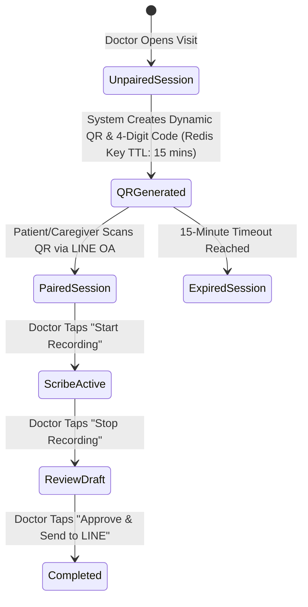

# Pre-Prototyping Design Checklist & Contract Specification

Before building visual UI mockups or writing frontend/backend code, complete these **5 Essential Design Deliverables**:

---

## 🎯 1. The Unified Clinical JSON Data Contract (API Schema)

Define the exact JSON data structure that flows between the **AI Engine**, **Doctor Portal**, and **LINE OA/PDF Engine**.

### 📄 File: `schema_encounter_draft.json`
```json
{
  "encounter_id": "ENC_9823",
  "patient_metadata": {
    "patient_name": "คุณสมศรี ใจดี",
    "caregiver_name": "คุณสมศักดิ์ ใจดี",
    "hn": "65-982314",
    "department": "OPD_CARDIOLOGY",
    "visit_date": "2026-08-02T10:45:00Z"
  },
  "patient_summary": {
    "reading_level": "Grade_5_Thai",
    "headline": "สรุปคำแนะนำจากคุณหมอหัวใจ",
    "key_instructions": [
      "ทานยาปรับระดับน้ำตาลตัวใหม่ (เม็ดใหญ่) เช้า-เย็น หลังอาหารทันที",
      "ดื่มน้ำสะอาดอย่างน้อยวันละ 8 แก้ว",
      "นัดตรวจครั้งถัดไป วันที่ 29 สิงหาคม 2026 เวลา 09:00 น."
    ]
  },
  "caregiver_matrix": {
    "medication_reconciliation": {
      "start": [
        {
          "med_name": "Metformin 1000mg",
          "physical_description": "ยาเม็ดใหญ่สีขาว",
          "frequency": "เช้า - เย็น",
          "instructions": "ทาน 1 เม็ด หลังอาหารทันที"
        }
      ],
      "stop": [
        {
          "med_name": "Metformin 500mg",
          "physical_description": "ยาเม็ดเล็กสีขาวซองเดิม",
          "action": "หยิบทิ้งถังขยะทันที ห้ามนำมารับประทานซ้ำ"
        }
      ],
      "change": [
        {
          "med_name": "Amlodipine 5mg",
          "physical_description": "ยาลดความดันเม็ดสีเหลือง",
          "adjustment": "ปรับลดเหลือวันละ 1 เม็ด ก่อนนอน (จากเดิม 2 เม็ด)"
        }
      ]
    },
    "red_flag_warnings": [
      "หากมีอาการเจ็บแน่นหน้าผากเหมือนมีของหนักทับ",
      "หน้ามืด วูบ เป็นลม หรือเหงื่อออกซึม ให้โทร 1669 ทันที"
    ]
  }
}
```

---

## 🖥️ 2. Doctor Portal Screen Wireframe Specifications

Design the 3 core screens for the Doctor Web App before building React components:

```
┌─────────────────────────────────────────────────────────────────────────────┐
│                       DOCTOR PORTAL WIREFRAME SPECS                         │
├──────────────────────────┬──────────────────────────────────────────────────┤
│ Screen Name              │ Key UI Elements & UX Triggers                    │
├──────────────────────────┼──────────────────────────────────────────────────┤
│ 1. Session & QR Pairing  │ • Dynamic QR Code + 4-digit pairing PIN          │
│    Screen                │ • Connection indicator ("🟢 Patient Connected") │
│                          │ • Digital Consent Checkbox                       │
├──────────────────────────┼──────────────────────────────────────────────────┤
│ 2. Ambient Scribe Screen │ • Pulsing Red "🔴 Live Scribe Active" Badge      │
│                          │ • Real-time WebSocket audio waveform visualizer  │
│                          │ • "Stop & Generate Summary" primary button       │
├──────────────────────────┼──────────────────────────────────────────────────┤
│ 3. Dual-View Review &    │ • Left Column: Patient View (Grade 5 Thai Text)  │
│    Sign-Off Screen       │ • Right Column: Caregiver Med Reconciliation     │
│    (<15s Target)         │   Matrix (🟢 Start / 🔴 Stop / 🟡 Change Badges)  │
│                          │ • Clickable audio timestamps [01:42] for audit   │
│                          │ • Primary Action: "✅ Approve & Send to LINE"    │
└──────────────────────────┴──────────────────────────────────────────────────┘
```

---

## 💬 3. LINE OA Flex Message & PDF Visual Design Specs

### A. LINE Flex Message Layout Specs
* **Card Header**: Dark Teal Blue (`#0F4C81`) with White Text: *"🏥 สรุปคำแนะนำจากคุณหมอ"*.
* **Patient Section**: Soft Gray Box (`#F8F9FA`) with 18pt bold text for patient instructions.
* **Medication Badges**:
  * 🟢 **START**: Light Green Container (`#E6F4EA`) + Dark Green Text (`#137333`).
  * 🔴 **STOP**: Light Red Container (`#FCE8E6`) + Dark Red Text (`#C5221F`).
  * 🟡 **CHANGE**: Light Yellow Container (`#FEF7E0`) + Dark Yellow Text (`#B06000`).
* **Action Buttons**:
  * Primary Button: Blue (`#1A73E8`) ➔ *"📄 ดาวน์โหลดใบนัด & คำแนะนำฉบับเต็ม (PDF)"*.
  * Secondary Button: Outline ➔ *"🔊 กดฟังเสียงอ่านสรุปคำแนะนำ"*.

### B. PDF Advice Sheet Specs
* **Page Layout**: Single-page A4 PDF (Portrait).
* **Typography**: Google Font **Sarabun** (Body: 14pt, Headers: 18pt Bold, Title: 24pt Bold).
* **Watermark**: Light gray diagonal text (45 degrees, 10% opacity): *"CONFIDENTIAL MEDICAL RECORD — VERIFIED VIA LINE OA"*.

---

## 🔑 4. Session Pairing & Token Expiration Logic

Design the state machine for linking patient LINE accounts to hospital sessions:



---

## 🚨 5. Verification Gate & Exception Handling Rules

Design how the system behaves when edge cases or errors occur:

| Exception Scenario | Detection Mechanism | System Behavior & UX Fix |
| :--- | :--- | :--- |
| **1. Unmasked PII Found** | Verification Gate regex finds raw Citizen ID / Phone | Red warning banner on Doctor Portal: *"🚨 PII detected. Please review masked words before sending."* |
| **2. Audio Stream Dropped** | WebSocket connection timeout > 5 seconds | Auto-reconnect & upload buffered audio chunks from browser `IndexedDB`. |
| **3. LLM Missing Fields** | Pydantic validation error on LLM JSON output | Fallback template inserted with tag: *"⚠️ Please manually verify medication list."* |
| **4. LINE Pairing Timeout** | QR Code expires after 15 minutes | Auto-refresh QR code button on Doctor screen. |
