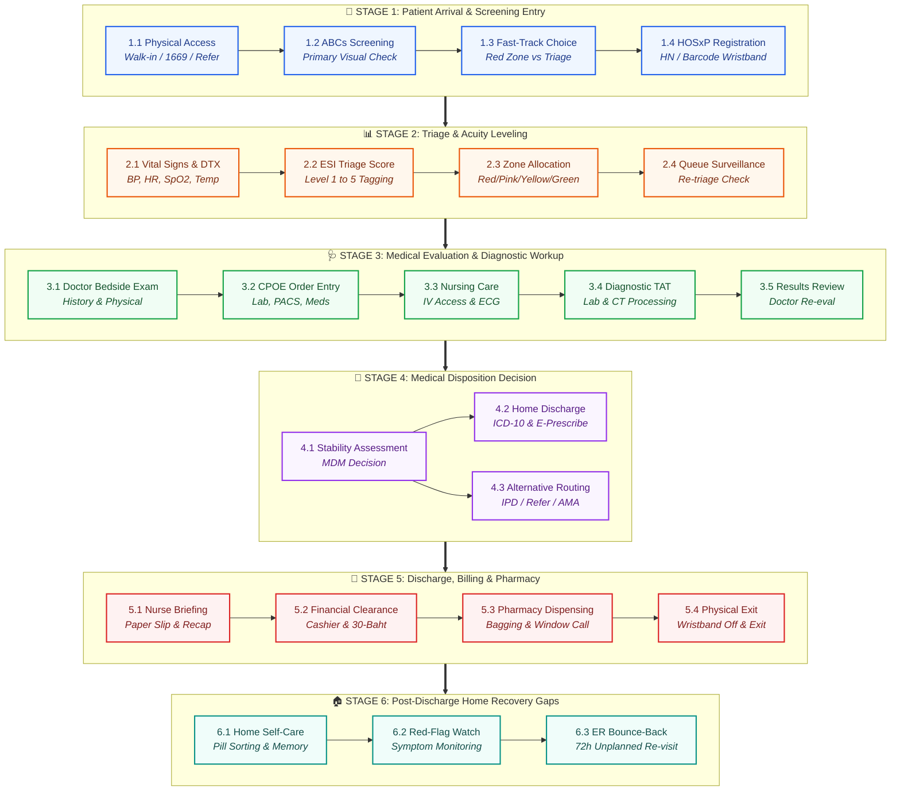

# Granular AS-IS Patient Flow Breakdown in Emergency Department (ED)
## Detailed Sub-Stage & Micro-Process Architecture (Arrival to Discharge)

---

## 1. Executive Summary

This document provides a **granular sub-stage breakdown** of the AS-IS Patient Flow in the Emergency Department (ED / ห้องฉุกเฉิน). Every main stage of the patient journey is decomposed into specific **sub-stages, micro-processes, operational inputs/outputs, clinical roles, system touchpoints, and friction points**.

This deep breakdown forms the operational baseline for engineering the **Ambient AI Doctor Advice & Caregiver Summarization (PVS)** platform, highlighting exactly where information drops, delays, and miscommunications occur.

---

## 2. Granular Sub-Stage Overview Map

---

## 3. High-Level Visual Stage Navigator Cards

| Stage Card | Sub-Stage ID & Name | Primary Clinical Activity | Key Risk / Failure Point |
| :--- | :--- | :--- | :--- |
| **STAGE 1** 🏥 **Arrival** | `1.1` Arrival Mode `1.2` ABC Screening `1.3` Fast-Track Choice `1.4` HOSxP Registration | Entry via door/1669, quick visual life-threat check, HN lookup, issuing barcode wristband. | Unannounced mass trauma arrival; unrecognized atypical critical presentation (e.g. silent MI). |
| **STAGE 2** 📊 **Triage** | `2.1` Vital Signs & DTX `2.2` ESI Triage Score `2.3` Zone Allocation `2.4` Queue Surveillance | Measuring BP/HR/SpO2/Temp, assigning ESI 1–5 level, seating in Red/Pink/Yellow/Green zones. | Overcrowding in Level 3 (Yellow zone); patients waiting without status updates leading to LWBS. |
| **STAGE 3** 🩺 **Evaluation**| `3.1` Doctor Exam `3.2` CPOE Order Entry `3.3` Nursing Execution `3.4` Lab/PACS TAT `3.5` Results Review | Bedside exam, ordering CPOE lab/imaging, IV cannulation, running Lab/CT analyzers, doctor re-eval. | **Major ED Bottleneck**: Long turnaround time (45–90 min) for blood lab results & CT scan queues. |
| **STAGE 4** 📑 **Disposition**| `4.1` Stability Assessment `4.2` Discharge E-Prescribe `4.3` IPD / Refer / AMA Routing | Medical decision (DC vs Admit vs Refer), entering ICD-10 codes, writing e-prescriptions & follow-up. | Ward bed shortages causing prolonged ED boarding; doctors writing medical shorthand/jargon. |
| **STAGE 5** 💊 **Discharge** | `5.1` Nurse Briefing `5.2` Cashier Settle `5.3` Pharmacy Dispensing `5.4` Physical Exit | Handing paper slip, 2-min verbal recap, cashier 30-baht clearance, drug bagging, wristband cut. | **High Friction**: Caregiver absent during recap; generic drug bag labels with tiny 8pt fonts. |
| **STAGE 6** 🏠 **Recovery** | `6.1` Home Self-Care `6.2` Red-Flag Watch `6.3` 72-Hour Bounce-Back | Caregiver organizing pills at home, monitoring red flags, returning to ER if condition worsens. | **Critical Breakdown**: Relatives mix old & new meds; instructions forgotten; preventable ER bounce-backs. |

---

## 4. Granular Breakdown of Each Stage & Sub-Stage

---

### Stage 1: Patient Arrival & Initial Entry (การเดินทางมาถึงและการเข้าสู่แผนก)

#### Sub-Stage 1.1: Physical Access & Arrival Mode Identification
* **Micro-Processes**:
  * `1.1.1` **Walk-in Entry**: Patient/family self-presents at ED main reception door.
  * `1.1.2` **EMS / Ambulance Entry**: EMS 1669 / foundation ambulance docks at ED trauma ramp; paramedic handoff to ED screen nurse.
  * `1.1.3` **Inter-Hospital Transfer Entry**: Referral ambulance arrives with transfer summary folder and nurse escort.
* **Personnel**: Security Guard, ED Porter, EMS Paramedic, Screening Nurse.
* **Systems & Inputs**: EMS Run Sheet, Transfer Form, Patient Physical Presence.
* **Outputs**: Physical reception into ED building.
* **AS-IS Friction**: Unannounced arrivals of multiple severe trauma/cardiac cases cause bottleneck at entry.

#### Sub-Stage 1.2: Immediate Primary Assessment & Red-Flag Screening
* **Micro-Processes**:
  * `1.2.1` **Airway, Breathing, Circulation (ABCs) Spot-Check**: Rapid visual evaluation of chest rise, skin color, respiratory distress, and active bleeding.
  * `1.2.2` **Consciousness & GCS Assessment**: Quick AVPU scale evaluation (Alert, Voice, Pain, Unresponsive).
  * `1.2.3` **Time-Critical Red Flag Identification**: Identifying acute STEMI (chest pain <12h), acute ischemic stroke (onset <4.5h), severe anaphylaxis, cardiac arrest, or shock.
* **Personnel**: Triage Nurse, Screening Nurse.
* **Systems & Inputs**: Visual inspection, SpO2 finger probe, automated BP cuff.
* **Outputs**: Immediate acuity status (Red Flag vs Non-Red Flag).
* **AS-IS Friction**: Patients with atypical presentation (e.g. diabetic silent MI) may be missed during quick visual screening.

#### Sub-Stage 1.3: Fast-Track Routing Decision
* **Micro-Processes**:
  * `1.3.1` **Resuscitation Bypass (Red Zone)**: Level 1 critical patients bypass registration and are wheeled directly into the CPR / Resuscitation room.
  * `1.3.2` **Triage Queue Routing**: Level 2–5 patients are routed to the Triage Counter line.
* **Personnel**: Triage Nurse, ED Porter.
* **Outputs**: Patient position in CPR room OR Triage queue.

#### Sub-Stage 1.4: Demographic & Administrative Registration
* **Micro-Processes**:
  * `1.4.1` **Identity Verification & HN Search**: Insert Thai National ID card into Smart Card Reader or search Patient Name/DOB in HOSxP HIS database.
  * `1.4.2` **Trauma / Anonymous Registration**: If patient is unconscious/unidentified without ID, issue temporary alias profile (e.g. `Unknown Male #1 (ED-20260729-001)`).
  * `1.4.3` **Chart & Barcode Wristband Issuance**: Print physical ED paper chart folder, patient barcode wristband, and digital HIS queue ticket.
* **Personnel**: ED Registration Clerk (เวชระเบียน).
* **Systems & Inputs**: HOSxP HIS Registration Module, Thai National ID Card Reader, Barcode Wristband Printer.
* **Outputs**: Active Hospital Number (HN), ED Encounter ID, Patient Wristband.
* **AS-IS Friction**: Registration delays due to missing ID cards, misspelled names, or system slow response.

---

### Stage 2: Triage & Acuity Classification (การคัดกรองความรุนแรงและจัดโซนการรักษา)

#### Sub-Stage 2.1: Physiological Parameter Measurement
* **Micro-Processes**:
  * `2.1.1` **Vital Signs Capture**: Measure Blood Pressure (BP), Pulse Rate (PR), Respiratory Rate (RR), SpO2, and Axillary Body Temperature (BT).
  * `2.1.2` **Pain Score Assessment**: Record 0–10 NRS Pain Score or Wong-Baker faces rating.
  * `2.1.3` **Capillary Blood Glucose (DTX)**: Perform fingerstick blood glucose check for diabetic history, altered mental state, or generalized weakness.
  * `2.1.4` **Focused History Interview**: Record Chief Complaint (CC), symptom duration, drug allergies, and basic medical history.
* **Personnel**: Triage Nurse, Assistant Nurse (PN/NA).
* **Systems & Inputs**: Vital signs monitor, Glucometer, Triage paper intake form / HOSxP Screen.
* **Outputs**: Complete Vital Signs dataset, Pain Score, DTX value, Chief Complaint.
* **AS-IS Friction**: Anxious relatives crowd the triage desk, causing noise and diagnostic distraction.

#### Sub-Stage 2.2: Formal Triage Acuity Scoring
* **Micro-Processes**:
  * `2.2.1` **Life Threat Evaluation**: Check if patient requires immediate life-saving intervention (ESI Level 1).
  * `2.2.2` **High-Risk Situation Assessment**: Determine if patient is high risk, confused/lethargic, or in severe distress (ESI Level 2).
  * `2.2.3` **Resource Utilization Prediction**: Count required diagnostic/therapeutic resources:
    * 2+ Resources (Labs + Imaging + IV) ➔ ESI Level 3 (Urgent).
    * 1 Resource (Simple X-ray OR Suture) ➔ ESI Level 4 (Semi-Urgent).
    * 0 Resources (Oral meds / Prescription refill) ➔ ESI Level 5 (Non-Urgent).
  * `2.2.4` **Triage Tagging in HOSxP**: Input Triage Level & Color Code into HOSxP Triage Module.
* **Personnel**: Triage Nurse.
* **Systems & Inputs**: Emergency Severity Index (ESI) Decision Tree / Thai MOPH Triage Criteria.
* **Outputs**: ESI Level (1 to 5), Triage Color Tag (Red, Pink, Yellow, Green, White).
* **AS-IS Friction**: Subjective variation between nurses leading to misclassification of Level 3 cases (over-triaging or under-triaging).

#### Sub-Stage 2.3: Zone Allocation & Queue Assignment
* **Micro-Processes**:
  * `2.3.1` **Red Zone Assignment**: ESI Level 1 ➔ Resuscitation Bed (Immediate care).
  * `2.3.2` **Pink/Orange Zone Assignment**: ESI Level 2 ➔ Acute Emergency Bay (Target physician exam <10 mins).
  * `2.3.3` **Yellow Zone Assignment**: ESI Level 3 ➔ Urgent Treatment Bay / Wheelchair Area (Target wait 30–60 mins).
  * `2.3.4` **Green/White Zone Assignment**: ESI Level 4 & 5 ➔ Fast-Track ED / Outpatient Clinic Area (Target wait 1–3 hours).
* **Personnel**: Triage Nurse, ED Nurse, Porter.
* **Outputs**: Bed assignment or Waiting Room seat ticket.

#### Sub-Stage 2.4: Waiting Area Monitoring & Re-Triage
* **Micro-Processes**:
  * `2.4.1` **Queue Board Display**: Digital display updates waiting ticket numbers per zone.
  * `2.4.2` **Waiting Area Surveillance**: Nurse periodically scans waiting room patients.
  * `2.4.3` **Condition Escalation (Re-triage)**: If waiting patient develops worsening symptoms (e.g. chest pain onset, vomiting, syncope), vital signs are re-taken and ESI level is escalated.
* **Personnel**: Waiting Room Nurse.
* **Systems & Inputs**: Digital Queue Board, Manual Call Speaker.
* **AS-IS Friction**: Patients wait without clear timeline updates, leading to anxiety, anger, or leaving without being seen (LWBS).

---

### Stage 3: Medical Evaluation & Diagnostic Workup (การตรวจรักษาและส่งตรวจวินิจฉัย)

#### Sub-Stage 3.1: Doctor Initial Consultation & Bedside Assessment
* **Micro-Processes**:
  * `3.1.1` **Bedside Arrival & Patient Verification**: Doctor calls patient/moves to bed, checks barcode wristband against paper chart / HOSxP screen.
  * `3.1.2` **Detailed History Taking**: Obtains History of Present Illness (HPI), past medical history (hypertension, diabetes, CAD, CKD), current medications, allergies, and surgical history.
  * `3.1.3` **Physical Examination**: Performs targeted physical exam (Heart, Lungs, Abdomen, Neurological reflexes, Wounds, Extremities).
* **Personnel**: ED Attending Physician, Resident, Intern.
* **Systems & Inputs**: Stethoscope, Otoscope, HOSxP Clinical History View.
* **Outputs**: Clinical Impression, Differential Diagnosis list.
* **AS-IS Friction**: Frequent interruptions by incoming ambulance trauma calls; ambient noise in ED bays hampers acoustic communication.

#### Sub-Stage 3.2: Computerized Physician Order Entry (CPOE)
* **Micro-Processes**:
  * `3.2.1` **Laboratory Orders**: Order blood panels (CBC, Electrolytes, BUN, Creatinine, LFT, Troponin-T/I, Coagulation PT/INR, ABG, Urinalysis, Blood Culture).
  * `3.2.2` **Diagnostic Imaging Orders**: Order X-rays (Chest, Abdomen, Bone), CT Scans (Head, Whole Abdomen, CTA), Ultrasound (FAST scan).
  * `3.2.3` **Diagnostic Procedures**: Order 12-lead ECG, Lumbar Puncture, Bedside Echo.
  * `3.2.4` **Therapeutic & Nursing Orders**: Order IV fluids (NSS, Acetar), STAT IV/IM medications (analgesics, anti-emetics, antibiotics, corticosteroids), oxygen therapy, nebulizer, wound suturing, splinting.
* **Personnel**: ED Physician.
* **Systems & Inputs**: HOSxP Order Entry System (CPOE Module).
* **Outputs**: Transmission of electronic requisitions to Lab, Radiology, and Nursing Station.
* **AS-IS Friction**: CPOE interface slow; doctors use shorthand medical acronyms (`NSS 1000 ml IV 80 ml/hr`, `Tramadol 50 mg IV STAT`).

#### Sub-Stage 3.3: Nursing Execution & Bedside Procedures
* **Micro-Processes**:
  * `3.3.1` **IV Access & Phlebotomy**: Insert peripheral IV cannula (18G–22G), collect blood tubes.
  * `3.3.2` **Specimen Dispatch**: Label blood/urine tubes with barcode wristband and send via pneumatic tube system or porter to Central Lab.
  * `3.3.3` **ECG Acquisition**: Perform 12-lead ECG, print paper tracing, present immediately to doctor.
  * `3.3.4` **Medication Administration**: Administer IV pushes, IV piggybacks, IM injections, or nebulizer treatments; record in Nursing MAR (Medication Administration Record).
  * `3.3.5` **Procedural Nursing**: Assist doctor with wound suturing, sterile dressing, tetanus vaccination, or plaster splint application.
* **Personnel**: ED Registered Nurse (RN), Practical Nurse (PN).
* **Systems & Inputs**: IV supplies, Blood tubes, ECG Machine, Suture sets, Medication Vials.
* **Outputs**: Venous access, Lab specimens dispatched, ECG paper tracing, Administered medications.
* **AS-IS Friction**: Difficult vein access in dehydrated/elderly patients; high nursing workload delays medication execution.

#### Sub-Stage 3.4: Diagnostic Processing & Imaging Execution
* **Micro-Processes**:
  * `3.4.1` **Central Lab Processing**: Lab receives blood, centrifuges, runs automated chemistry/hematology analyzers (Turnaround Time - TAT: 45–90 mins).
  * `3.4.2` **Radiology Transport & Scan**: Porter escorts patient to X-Ray or CT suite; radiographer positions patient and executes scan.
  * `3.4.3` **PACS Upload & Radiologist Reading**: Images uploaded to Picture Archiving and Communication System (PACS); radiologist issues preliminary or formal report.
* **Personnel**: Medical Lab Technologist, Radiographer, Radiologist.
* **Systems & Inputs**: LIS (Laboratory Information System), PACS, CT Scanner, X-Ray Unit.
* **Outputs**: Lab Result Values in HOSxP, Digital Radiological Images & Text Reports in PACS.
* **AS-IS Friction**: **Major ED Bottleneck**: Waiting for lab results (Troponin/CBC) and CT scan queues delays patient disposition for hours.

#### Sub-Stage 3.5: Results Review & Clinical Re-evaluation
* **Micro-Processes**:
  * `3.5.1` **Result Review**: Doctor checks lab parameters and imaging reports on HOSxP/PACS.
  * `3.5.2` **Bedside Re-examination**: Doctor re-evaluates patient response (pain reduction, vital signs stabilization, neurological improvement).
  * `3.5.3` **Specialist Consultation**: If complex pathology found (e.g. acute appendicitis, fracture, STEMI), doctor calls On-Call Specialist (General Surgery, Orthopedics, Cardiology) for consult.
* **Personnel**: ED Physician, On-Call Specialist.
* **Outputs**: Confirmed Working Diagnosis, Final Treatment Plan.
* **AS-IS Friction**: Results ready on computer screen, but doctor is occupied with new critically ill arrivals, delaying review.

---

### Stage 4: Medical Disposition Decision (การตัดสินใจทางเวชกรรม)

#### Sub-Stage 4.1: Medical Decision Making (MDM)
* **Micro-Processes**:
  * `4.1.1` **Clinical Stability Determination**: Doctor determines if patient acute emergency is resolved and patient is safe for home recovery, OR requires hospital admission.
  * `4.1.2` **Disposition Selection**: Select disposition option in HOSxP:
    1. **Discharge Home (DC)**.
    2. **Admit to Inpatient Ward / ICU (IPD)**.
    3. **Transfer to Tertiary Hospital (Refer-out)**.
    4. **ED Observation Unit Stay (Obs Unit for 6–24h)**.
    5. **Against Medical Advice (AMA / Refuse Treatment)**.
* **Personnel**: ED Attending Physician.
* **Outputs**: Selected Disposition Category in HOSxP.

#### Sub-Stage 4.2: Discharge Documentation & Order Finalization (For Home DC Cases)
* **Micro-Processes**:
  * `4.2.1` **ICD-10 Coding Entry**: Input Primary Diagnosis Code (e.g. `K29.7 Gastritis`, `S52.5 Fracture distal radius`) and Secondary Diagnosis Codes.
  * `4.2.2` **Outpatient Prescription (E-Prescribing)**: Select discharge medications (Drug name, strength, dosage e.g., *Paracetamol 500mg 1 tab po prn q6h*, *Amoxicillin 500mg 1 tab po bid pc x 7 days*).
  * `4.2.3` **Follow-Up Appointment Booking (Nadt)**: Select follow-up clinic (e.g. Surgical OPD), appointment date, time, and pre-visit lab requests.
  * `4.2.4` **Written Instructions Entry**: Type discharge advice and home care instructions into EHR summary field.
* **Personnel**: ED Physician.
* **Systems & Inputs**: HOSxP Discharge & Prescription Module, ICD-10 Coding Index.
* **Outputs**: Completed Electronic Discharge Order, Digital Prescription, Electronic Appointment Slip.
* **AS-IS Friction**: Rushed typing leads to medical shorthand and brief instructions; no patient-tailored language simplification.

#### Sub-Stage 4.3: Non-Discharge Routing Processes (Alternative Disposition Pathways)
* **Micro-Processes**:
  * `4.3.1` **IPD Admission Pathway**: Doctor completes IPD Admission Note ➔ Nurse contacts Bed Center ➔ Ward Bed Assigned ➔ Nurse-to-Nurse Handoff ➔ Transport patient to Ward/ICU.
  * `4.3.2` **Referral Transfer Pathway**: Doctor completes MOPH Refer-Out Form ➔ Contact receiving hospital physician ➔ Arrange EMS transport ambulance ➔ Handover to transport team.
  * `4.3.3` **Observation Unit Pathway**: Move patient to 6–24h ED Obs bed for serial blood tests / cardiac monitoring.
  * `4.3.4` **AMA Pathway**: Doctor/nurse counsel patient/relatives on severe risks of leaving ➔ Sign legal AMA Waiver Form (หนังสือปฏิเสธการรักษา) ➔ Hand over basic prescriptions & release.
* **Personnel**: ED Physician, Ward Nurse, Referral Coordinator, Transport Paramedics.
* **Outputs**: IPD Chart, Refer-Out Form, signed AMA Waiver.

---

### Stage 5: Discharge Process, Billing & Pharmacy Dispensing (ขั้นตอนการจำหน่าย การเงิน และห้องยา)

#### Sub-Stage 5.1: Clinical Discharge Counseling & Bedside Handover
* **Micro-Processes**:
  * `5.1.1` **Discharge Order Verification**: Nurse checks HOSxP to confirm doctor has signed off discharge orders.
  * `5.1.2` **Paper Document Printing & Handover**: Nurse prints physical Appointment Slip (ใบนัด), Medical Certificate (ใบรับรองแพทย์), and Discharge Summary copy.
  * `5.1.3` **Verbal Counseling**: Nurse gives brief verbal explanation of wound care, home activity, and follow-up date (Duration: 2–4 mins).
* **Personnel**: ED Discharge Nurse.
* **Systems & Inputs**: HOSxP Printed Documents, Appointment Slip.
* **Outputs**: Physical Paper Document Folder handed to patient/relative.
* **AS-IS Friction**: **High Friction Point**: ED noise, rushed nurse explanation, patient anxious to leave; family caregivers waiting outside miss the conversation entirely.

#### Sub-Stage 5.2: Financial Clearance & Cashier Settlement
* **Micro-Processes**:
  * `5.2.1` **Cashier Queue Arrival**: Patient/Caregiver takes paper chart folder to ED Financial Cashier Counter.
  * `5.2.2` **Health Coverage Rights Verification**: Check national database for Universal Coverage (UC 30-Baht / สิทธิ 30 บาท), Social Security Scheme (SSS / ประกันสังคม), Civil Servant Benefit (CSMBS / กรมบัญชีกลาง), Private Insurance, or Self-Pay.
  * `5.2.3` **Financial Settlement & Receipt**: Collect non-reimbursable copayments (e.g. special drugs, medical devices, emergency after-hours fee); issue financial tax receipt; stamp prescription slip as **"PAID / CLEARED"**.
* **Personnel**: Financial Staff / Cashier (การเงิน).
* **Systems & Inputs**: Finance Module, POS Terminal, National Rights Verification Database.
* **Outputs**: Financial Receipt, Stamped Prescription Slip.
* **AS-IS Friction**: Long cashier queues during evening/weekend shifts when OPD cashier is closed.

#### Sub-Stage 5.3: Pharmacy Verification, Dispensing & Labeling
* **Micro-Processes**:
  * `5.3.1` **Prescription Reception & Screening**: Dispensing Pharmacist receives electronic prescription from HOSxP, screens for drug interactions, allergies, and dosage safety.
  * `5.3.2` **Pill Picking & Thermal Label Printing**: Pharmacy technician picks medication packages/bottles, prints thermal drug labels, and packs them into clear plastic bags.
  * `5.3.3` **Final Pharmacist Double-Check**: Pharmacist verifies picked medications against electronic prescription.
  * `5.3.4` **Pharmacy Window Call & Briefing**: Pharmacist calls patient name via loudspeaker, verifies patient identity, hands over medication bags, and gives quick verbal instruction on how to take pills.
* **Personnel**: Dispensing Pharmacist, Pharmacy Technician.
* **Systems & Inputs**: Pharmacy Dispensing System, Thermal Label Printers, Prescription Bags.
* **Outputs**: Labeled Prescription Drug Bags handed to patient.
* **AS-IS Friction**: Drug bag labels have tiny 8pt font; generic printed instructions (*"Take 1 tablet after meals 3 times daily"*); no explicit instructions on which old home medications to STOP taking.

#### Sub-Stage 5.4: Physical Exit & Departure
* **Micro-Processes**:
  * `5.4.1` **Wristband Removal**: Nurse/porter cuts off patient barcode wristband.
  * `5.4.2` **Belongings Check**: Patient collects personal items and IV line is removed (if still present).
  * `5.4.3` **ED Departure**: Patient exits ED via walking, wheelchair assistance, or private vehicle pick-up at ramp.
* **Personnel**: Patient, Relative, ED Porter, Security Guard.
* **Outputs**: Physical exit from hospital.
* **AS-IS Friction**: Zero digital copy of instructions sent to patient's phone or relative's LINE OA; information relies 100% on paper slips and memory.

---

### Stage 6: Post-Discharge At-Home Recovery & Operational Failure Points (การดูแลต่อที่บ้านและจุดล้มเหลว)

#### Sub-Stage 6.1: At-Home Self-Management & Caregiver Execution
* **Micro-Processes**:
  * `6.1.1` **Unpacking Medications**: Family relative unpacks multiple drug bags at home.
  * `6.1.2` **Schedule Interpretation**: Caregiver attempts to organize morning/afternoon/evening pill boxes based on memory and bag labels.
  * `6.1.3` **Home Care Execution**: Performing wound dressing changes, applying cold packs, or administering nebulizers based on memory of nurse verbal instructions.
* **Personnel**: Patient, Family Relative / Caregiver (ลูกหลาน/ผู้ดูแล), Village Health Volunteer (อสม.).
* **Outputs**: Home medication administration & self-care tasks.
* **AS-IS Friction**: **Critical Breakdown**: Relatives confuse old prescriptions with new ED medications, continuing discontinued drugs; verbal instructions forgotten within hours.

#### Sub-Stage 6.2: Symptom Surveillance & Emergency Red-Flag Recognition
* **Micro-Processes**:
  * `6.2.1` **Home Symptom Tracking**: Patient/Caregiver monitors for post-discharge recovery vs deterioration.
  * `6.2.2` **Red-Flag Warning Spotting**: Watching for dangerous signs (e.g. high fever, wound redness/pus, severe chest pain, recurring dizziness, vomiting blood).
  * `6.2.3` **Uncertain Decision Making**: Caregiver feels anxious and uncertain whether to wait for follow-up appointment, call clinic, or return to ED.
* **Personnel**: Patient & Family Caregiver.
* **AS-IS Friction**: No direct digital line or clear red-flag checklist to guide emergency decisions; patients delay returning during severe complications.

#### Sub-Stage 6.3: 72-Hour Unplanned ED Bounce-Back (Re-visit)
* **Micro-Processes**:
  * `6.3.1` **Unplanned ED Re-entry**: Patient condition deteriorates or drug error occurs ➔ Family brings patient back to ED within 72 hours.
  * `6.3.2` **Re-Initiation of ED Flow**: Patient re-enters at Stage 1 as a new emergency encounter.
* **Personnel**: Patient, ED Clinical Team.
* **Systems & Inputs**: HOSxP 72-Hour Re-visit Tracking Log.
* **Outputs**: High operational cost, overcrowding, increased patient morbidity, potential hospital readmission penalties.

---

## 5. Sub-Stage Automation Mapping for AI PVS Engine

| Sub-Stage ID & Name | Current Manual Process | AI Ambient PVS Platform Transformation |
| :--- | :--- | :--- |
| `3.1` **Doctor Bedside Exam** | Doctor speaks quickly, typing into HOSxP; ambient noise in ED room. | **Ambient Passive Voice Recording**: Diarizes `[Doctor]` and `[Caregiver]` voices, capturing clinical intent & advice. |
| `4.2` **Discharge Order & Meds** | Doctor inputs shorthand drug orders (`Paracetamol 500mg 1 tab po q6h`). | **Medication Reconciliation Matrix**: Converts CPOE orders into 🟢 Start, 🔴 Stop, 🟡 Change table for home caregivers. |
| `5.1` **Nurse Discharge Briefing** | 2-min verbal recap with paper slip; caregiver outside misses info. | **Multi-Audience PVS Card**: Generates 5th-grade Thai Patient Card & LINE OA Caregiver Task Card. |
| `5.4` **Physical Exit** | Patient leaves with paper appointment slip only. | **LINE OA Digital Delivery**: Pushes Interactive Care Card with Voice Playback (Text-to-Speech) directly to smartphone. |
| `6.2` **Red-Flag Monitoring** | Self-guided; caregiver uncertain when to return to ER. | **Emergency Red-Flag Card**: High-contrast warning card with 1-Tap 1669 Emergency Ambulance call button. |
| `6.3` **72h ED Bounce-Back** | ER re-visit due to med errors or confusion. | **Closed-Loop Read Receipt**: Caregiver taps *"Confirmed"* button; nurse receives receipt, preventing bounce-backs. |

---

## 6. Document Revision & Integration Mapping

* **Document Version**: 3.0.0 (Redesigned Visual Overview & Sub-Stage Architecture)
* **Target Application**: Ambient AI Doctor Advice & Caregiver Summarization (PVS Platform)
* **Author**: AI Healthcare Architecture Team
