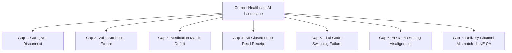

# Comprehensive Gap Analysis: Why This Project is Needed

---

## 1. Executive Summary

Despite rapid growth in healthcare technology and AI medical scribing, existing market solutions—both international platforms (Abridge, Suki AI, Nabla, Nuance DAX) and local Thai systems (PresScribe by Looloo, MOR-ASR by CARIVA, BMS AI)—leave severe unaddressed gaps in clinical safety, health literacy, family caregiver management, and local workflow integration.

This document outlines the **Detailed Review of Ambient PVS Platforms in Thailand**, the **7 Critical Market & Technological Gaps**, and examines **Why Ambient PVS Has Not Yet Become Ubiquitous or Popular**.

---

## 2. Review of Ambient PVS Platforms in Thailand

A thorough review of Thailand's current healthcare AI and medical documentation ecosystem reveals that **no existing platform in Thailand provides a dedicated Ambient Patient Visit Summary (PVS) for patients and family caregivers**:

```
┌─────────────────────────────────────────────────────────────────────────────┐
│               REVIEW OF THAI PLATFORMS & AMBIENT PVS STATUS                 │
├──────────────────────────┬──────────────────────────┬───────────────────────┤
│ Platform / Provider      │ Ambient AI Capability    │ PVS / Patient Output  │
├──────────────────────────┼──────────────────────────┼───────────────────────┤
│ 1. PresScribe            │ ✅ Ambient Thai-English  │ 🔴 Clinician SOAP note│
│    (Looloo Health)       │    ASR for HOSxP         │    only (No PVS card).│
├──────────────────────────┼──────────────────────────┼───────────────────────┤
│ 2. MOR-ASR                │ ✅ Ambient medical voice │ 🔴 Hospital HIS note  │
│    (CARIVA / PTT)        │    transcription         │    only (No PVS card).│
├──────────────────────────┼──────────────────────────┼───────────────────────┤
│ 3. BMS AI                │ ❌ Text AI only (No      │ 🔴 HOSxP desktop chart│
│    (HOSxP Developer)     │    ambient voice)        │    recap for doctors. │
├──────────────────────────┼──────────────────────────┼───────────────────────┤
│ 4. AgNOS Health          │ ❌ Pre-visit Q&A (No     │ 🔴 Pre-visit OPD      │
│    (แอกนอส)               │    ambient recording)    │    triage summary.    │
├──────────────────────────┼──────────────────────────┼───────────────────────┤
│ 5. Gowajee (Chula U)     │ 🎙️ Thai Speech API      │ 🔴 Raw Voice API      │
│                          │    (DMIND screening)     │    (No PVS app).      │
├──────────────────────────┼──────────────────────────┼───────────────────────┤
│ 6. Mor Prom (หมอพร้อม) &  │ ❌ Electronic record     │ 🔴 Raw medical data   │
│    Health Link (BDI)     │    repository            │    (No AI PVS card).  │
└──────────────────────────┴──────────────────────────┴───────────────────────┘
```

### Detailed Platform Review in Thailand

#### 1. PresScribe (Looloo Health)
* **What it does**: PresScribe is the leading ambient medical AI scribe in Thailand, using Looloo's "Thanaburian Whisper" Thai ASR model. It listens to consultations and generates clinical notes directly inside **HOSxP** (used in 70-80% of public hospitals).
* **Ambient PVS Assessment**: **Clinician-Facing Only**. PresScribe focuses ~90% of its pipeline on generating doctor medical notes for HOSxP. It does *not* simplify speech into 5th-grade Thai text for patients, nor does it deliver caregiver advice cards via LINE OA.

#### 2. MOR-ASR (CARIVA / PTT Group ARV)
* **What it does**: Ambient medical speech recognition supporting Thai-English code-switching for public and private hospital encounters.
* **Ambient PVS Assessment**: **No Patient Summary Engine**. Built exclusively as an enterprise B2B clinical documentation tool for hospital electronic medical records.

#### 3. BMS AI (Bangkok Medical Software — Developers of HOSxP)
* **What it does**: BMS AI Summarize is a text-based AI feature built natively inside HOSxP desktop software to summarize past patient medical histories for doctors.
* **Ambient PVS Assessment**: **No Ambient Voice & No Mobile Delivery**. It does not perform ambient voice recording in the exam room, nor does it send mobile advice cards to patients or relatives.

#### 4. AgNOS Health (แอกนอส)
* **What it does**: AgNOS Smart OPD provides AI symptom screening and triage before the patient sees the doctor.
* **Ambient PVS Assessment**: **Pre-Visit Only**. Does not record ambient exam room dialogue or generate post-visit caregiver advice cards.

#### 5. Gowajee (กว๊าจี - Chulalongkorn University)
* **What it does**: Provides foundational Thai Speech-to-Text (ASR) voice infrastructure (powering DMIND depression screening).
* **Ambient PVS Assessment**: **Voice Engine API Only**. Does not provide an end-to-end PVS application for patients.

#### 6. Mor Prom (หมอพร้อม) & Health Link (BDI)
* **What it does**: National digital health app (50M+ users) and Health Information Exchange platform storing vaccination records, lab results, and appointments.
* **Ambient PVS Assessment**: **Raw Data Repository**. Stores raw medical records; does not perform AI ambient voice summarization or plain-language simplification for family caregivers.

---

## 3. Why Ambient PVS Has Not Yet Become Popular (Adoption Barriers)

Despite the clear health benefits of Patient Visit Summaries, ambient PVS adoption faces 6 massive systemic and technical roadblocks:

```
┌─────────────────────────────────────────────────────────────────────────────┐
│                    WHY AMBIENT PVS IS NOT YET POPULAR                       │
├──────────────────────────┬──────────────────────────────────────────────────┤
│ 1. Malpractice Liability │ 🔴 Doctors fear legal liability for AI errors /  │
│    & Review Bottleneck   │    omissions, forcing manual edits that slow OPD. │
├──────────────────────────┼──────────────────────────────────────────────────┤
│ 2. Buyer Incentive       │ 🔴 Hospital CFOs buy AI for ICD-10 Billing/Coding│
│    Mismatch              │    treating patient summaries as "nice-to-have". │
├──────────────────────────┼──────────────────────────────────────────────────┤
│ 3. Chaotic Exam Room     │ 🔴 Overlapping voices, loud background noise, &  │
│    Acoustics & Speech    │    implicit/conditional clinical dialogue.      │
├──────────────────────────┼──────────────────────────────────────────────────┤
│ 4. Code-Switching &      │ 🔴 Global AI fails on Thai-English medical speech │
│    Language Barriers     │    ("อัพโดส Metformin 1000mg tid").              │
├──────────────────────────┼──────────────────────────────────────────────────┤
│ 5. Ambient Recording     │ 🔴 Patient & doctor anxiety over being recorded │
│    Privacy Anxiety       │    during sensitive medical consultations.       │
├──────────────────────────┼──────────────────────────────────────────────────┤
│ 6. Delivery Interop      │ 🔴 Summaries get stuck in third-party apps       │
│    Bottleneck            │    instead of reaching patient/caregiver LINE OA.│
└──────────────────────────┴──────────────────────────────────────────────────┘
```

### Barrier 1: Clinician Malpractice Liability & The Review Bottleneck
* **"Captain of the Ship" Doctrine**: Under medical malpractice law, the attending physician bears 100% legal liability for any error, omission, or dosage mistake in advice given to a patient or caregiver.
* **Review Friction**: Because doctors are terrified of AI hallucinations (e.g., omitting *"Do not drive after taking"*), they feel compelled to carefully read and edit every single line of the generated PVS. If auditing the AI draft takes 2 minutes, and a doctor in a public hospital OPD only has 3 minutes per patient, **the AI slows the doctor down instead of speeding them up**.

### Barrier 2: The Buyer Incentive Mismatch (Billing vs. Patient Care)
* **Who Buys Health Software**: Hospital software is purchased by CFOs and IT directors, not patients.
* **Revenue Priority**: Hospital CFOs prioritize AI software that directly increases **billing coding (ICD-10/CPT), clinical documentation, and revenue cycle management**. As a result, commercial vendors (Abridge, Nuance DAX, PresScribe) spent 90% of their early R&D building *Doctor SOAP Notes*, leaving patient-facing PVS as a secondary feature.

### Barrier 3: Acoustic Chaos & Implicit Human Speech in Real Exam Rooms
* **Noisy Exam Rooms**: Real hospital exam rooms (especially public hospital OPDs) are loud, chaotic environments with fans blowing, paper rustling, crying children, and doors slamming.
* **Implicit Doctor Speech**: Doctors rarely speak in structured textbook sentences. They say things like: *"Yeah, let's keep doing what we were doing, but maybe hold off on the white pill if your stomach hurts."* Disentangling implicit, conditional human conversation into precise Grade 5 medical advice is extremely difficult for generic AI.

### Barrier 4: Multi-lingual & Code-Switching Failures (Local Reality)
* **Code-Switching in Asia/Thailand**: Thai clinicians speak in **Thai-English Code-Switching** (*"หมอขออัพโดส Metformin เป็น 1000mg tid หลังอาหารนะครับ"*). Global AI engines (Whisper, GPT-4) fail to parse this hybrid speech into readable 5th-grade Thai.

### Barrier 5: Ambient Recording Privacy & Wiretapping Anxiety
* **Recording Consent**: Actively recording audio in an exam room raises immediate privacy concerns (HIPAA, PDPA in Thailand, wiretapping consent laws).
* **Sensitive Topics**: Patients and doctors feel uncomfortable having an active microphone recording sensitive topics (mental health, sexual health, addiction).

### Barrier 6: Delivery Interoperability Bottleneck
* **Trapped Summaries**: Even if an AI generates a great summary, it often gets trapped inside a third-party vendor portal or desktop EHR (HOSxP, Epic) because the hospital lacks open APIs or LINE OA integration to push the card to the family caregiver's smartphone.

---

## 4. The 7 Critical Gaps Identified



### Gap 1: The Relative & Family Caregiver Disconnect (The #1 Market Gap)
* **Current State**: 100% of commercial AI scribes (Abridge, Suki, Nabla, PresScribe) generate a single advice output designed exclusively for the **patient**.
* **Why This Fails**: In reality, elderly patients, post-op surgical patients, and pediatric patients do *not* manage their own recovery. Family relatives (adult children, spouses, home aides) buy the drugs, change dressings, and monitor warning signs.
* **Why This Project is Needed**: This project builds the first **Multi-Audience Engine** that simultaneously generates:
  1. A **Patient-Self View** (Simple language, audio playback, high-level summary).
  2. A **Caregiver / Relative View** (Task checklist, medication administration rules, emergency triggers).

### Gap 2: Ambient Voice Attribution for Caregiver Dialogue
* **Current State**: Current ambient AI diarization engines classify voices strictly into two roles: `[Doctor]` or `[Patient]`.
* **Why This Fails**: During exam room visits, family members frequently ask critical operational questions (e.g., *"Mom forgets her morning pills, can she take them at dinner?"*). Current AI merges this into generic patient text or ignores it.
* **Why This Project is Needed**: Our system tags `[SPEAKER: CAREGIVER_RELATIVE]`, extracts the relative's specific questions, and explicitly embeds the doctor's answers into the **Caregiver PVS**.

### Gap 3: Medication Reconciliation & Administration Schedule Matrix
* **Current State**: Existing tools list medications in generic bullet points (e.g. *"Lisinopril 10mg daily"*).
* **Why This Fails**: Family caregivers administering home medications need to know what was *changed*, what was *stopped*, and *how to administer* each pill. Confusion leads to patients continuing to take old, discontinued drugs alongside new ones.
* **Why This Project is Needed**: We provide a dedicated **Medication Reconciliation Matrix**:
  * 🟢 **NEW Meds to Start** (Name, dose, timing, with/without food).
  * 🔴 **OLD Meds to STOP** (Explicit instruction to discard old prescriptions).
  * 🟡 **CHANGED Dosages**.

### Gap 4: Lack of Closed-Loop Read Receipts & Comprehension Verification
* **Current State**: Current PVS systems push static notes or PDFs to patient portals with **zero feedback** on whether the advice was read or understood.
* **Why This Fails**: Doctors have no way of knowing if a high-risk instruction (e.g., *"Stop blood thinners 3 days before surgery"*) was acknowledged by the family.
* **Why This Project is Needed**: Our portal includes **Interactive Micro-Confirmations** (e.g., caregiver taps *"I Confirm I Will Stop Aspirin on Thursday"*), sending an automated read receipt back to the clinic nurse.

### Gap 5: Thai Language Medical Code-Switching & Health Literacy Gap
* **Current State**: Global AI models (like GPT-4 or generic ASR) struggle with the acoustic and linguistic reality of Thai clinical encounters.
* **Why This Fails**: Thai doctors routinely speak in **Thai-English Code-Switching** (mixing Thai grammar with English drug names & acronyms e.g., *"หมอขออัพโดส Metformin เป็น 1000mg tid หลังอาหารนะครับ"*). Global models misinterpret abbreviations or produce awkward literal translations.
* **Why This Project is Needed**: We utilize Thai-specialized ASR (Gowajee / Whisper-Thai) paired with Thai LLM prompt engineering (Typhoon / Gemini) tuned to parse clinical code-switching into 5th-grade Thai.

### Gap 6: High-Velocity Clinical Setting Adaptation (ED & IPD vs. OPD)
* **Current State**: Most AI scribes are built for routine 15-minute Outpatient (OPD) clinic encounters.
* **Why This Fails**: 
  * **Emergency Department (ED)** discharges require high-priority, bolded **Red-Flag Return Warnings** (preventing 72-hour ER bounce-backs).
  * **Inpatient (IPD)** discharges require complex **Post-Op Wound & Mobility Checklists**.
* **Why This Project is Needed**: Our architecture includes setting-specific prompt templates for OPD, ED, and IPD discharges.

### Gap 7: Local Delivery Channel Mismatch in Thailand (LINE OA & อสม. Integration)
* **Current State**: Existing tools push summaries to desktop EHRs or require patients to download heavy native mobile apps.
* **Why This Fails**: In Thailand, elderly patients and rural caregivers rarely download specialized hospital apps. However, **90%+ of Thais use LINE daily**.
* **Why This Project is Needed**:
  * **LINE Official Account (LINE OA)**: Delivers PVS advice cards directly via LINE messages with rich cards and voice playback.
  * **อสม. (Village Health Volunteer) Integration**: Generates a simplified home-visit checklist for Thailand's **1 Million+ Village Health Volunteers** checking on rural elderly.

---

## 5. Gap Resolution Summary Matrix

| Gap Identified | Current Industry State | How This Project Solves It |
| :--- | :--- | :--- |
| **1. Caregiver Disconnect** | 100% single-patient output | **Dual Engine**: Generates Patient View + Relative Caregiver Matrix. |
| **2. Voice Attribution** | Doctor vs. Patient only | **Diarizes Caregiver Voice** (`SPEAKER: CAREGIVER`) & embeds direct Q&A. |
| **3. Med Reconciliation** | Generic bulleted med lists | **Start / Stop / Change Matrix** for home med administration. |
| **4. Comprehension Tracking**| Static PDF, zero feedback | **Closed-Loop Read Receipts** via micro-confirmation taps. |
| **5. Thai Code-Switching** | Fails on Thai-English med speech | **Thai ASR (Gowajee/Whisper) + Thai Medical LLM (Typhoon/Gemini)**. |
| **6. Setting Adaptation** | Outpatient (OPD) focus only | **ED Red-Flag Cards** & **IPD Wound/Recovery Checklists**. |
| **7. Delivery Channel** | Desktop EHR or heavy apps | **LINE Official Account (LINE OA) + อสม. Caregiver Cards**. |
