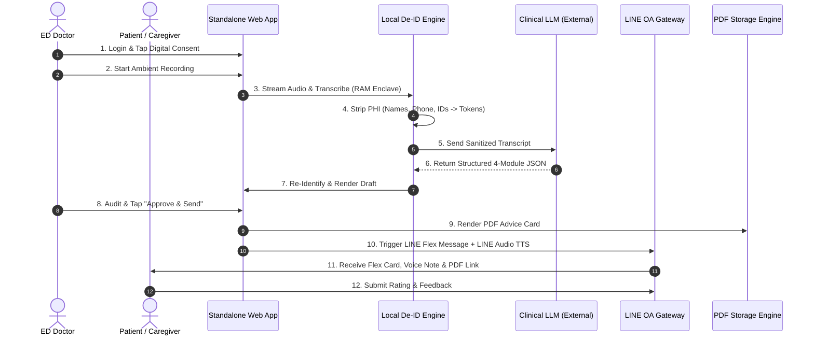

# Product Requirements Document (PRD)
## Ambient AI Emergency Department Advice & Caregiver Summarization Platform (Phase 1 MVP)

---

| Document Attribute | Value |
| :--- | :--- |
| **Product Name** | Ambient AI ED Advice & Caregiver Scribe (Phase 1 MVP) |
| **Document Version** | 1.0.0 (Final Draft) |
| **Target Environment** | Emergency Department (ED / ห้องฉุกเฉิน) |
| **Primary Target Users** | ED Physicians, ED Patients, Family Caregivers (ลูกหลาน/ผู้ดูแล) |
| **Integrations** | Standalone Web Portal + LINE OA + PDF Engine (No EHR Integration in Phase 1) |

---

## 1. Executive Summary & Problem Statement

### 1.1 Context & Problem Definition
The Emergency Department (ED) is a high-stress, fast-paced, and noisy clinical environment. Upon ED discharge, patients and family caregivers are overwhelmed by anxiety, complex medical jargon, and rapid-fire verbal instructions. 

This communication gap leads to severe post-discharge failure points:
1. **Post-Visit Amnesia**: Patients forget 60–80% of verbal ED discharge instructions immediately upon leaving.
2. **Fatal Medication Errors**: Patients fail to understand which home medications to **HOLD/STOP** versus which acute ED medications to **START**, resulting in adverse drug events.
3. **Caregiver Blindness**: Adult children and family relatives caring for elderly patients are left guessing what happened in the ED.
4. **Preventable ED Bounce-Backs**: Lack of clear 24–72 hour emergency "Red Flag" warnings leads to unnecessary ED re-visits or delayed critical care.

### 1.2 The Solution
An **Ambient AI Emergency Department Advice & Caregiver Summarization Platform** that passively listens to bedside ED consultations, sanitizes sensitive health data, generates plain-language (Grade 5 Thai) dual-view discharge summaries, and delivers them instantly to patients and caregivers via **LINE OA (Flex Messages + Native Audio TTS + Downloadable PDF)** following doctor sign-off.

---

## 2. Product Scope: Phase 1 MVP vs. Phase 2 Scale-Up

```
┌─────────────────────────────────────────────────────────────────────────────┐
│                       PHASE 1 MVP SCOPE BOUNDARIES                          │
├───────────────────────────────────┬─────────────────────────────────────────┤
│ IN SCOPE (Phase 1 MVP)            │ OUT OF SCOPE (Deferred to Phase 2)      │
├───────────────────────────────────┼─────────────────────────────────────────┤
│ ✅ Standalone Doctor Approval Portal│ ❌ HOSxP / Hospital EHR Integration     │
│ ✅ Digital Consent Banner (Tablet/Web)│ ❌ Paper Consent Form Processing        │
│ ✅ Pre-LLM De-Identification (PHI) │ ❌ Village Health Volunteers (อสม.) Link│
│ ✅ ED Medication Reconciliation   │ ❌ Direct ICD-10 Billing Code Auto-Sync │
│ ✅ LINE OA Delivery + Audio TTS   │ ❌ In-hospital Patient Portal Mobile App│
│ ✅ Downloadable PDF Advice Card   │ ❌ Automatic Hospital Network API Auth  │
│ ✅ LINE & Doctor CSAT Feedback    │ ❌ Readmission EMR Outcomes Sync         │
└───────────────────────────────────┴─────────────────────────────────────────┘
```

---

## 3. Target User Personas

### 👨‍⚕️ Persona 1: ED Physician (Attending / Resident)
* **Goal**: Provide safe, clear discharge instructions without spending extra time typing notes or repeating verbal advice.
* **Key Constraint**: Cannot spend $>15-20$ seconds auditing AI-generated drafts during chaotic ED shifts.
* **Needs**: 1-click audio evidence verification, rapid edit/approval portal, zero legal liability risks.

### 👴 Persona 2: ED Patient (e.g. Elderly / Low-Literacy)
* **Goal**: Understand what illness they have, what caused it, and what to do at home.
* **Key Constraint**: Cannot read complex handwriting or medical jargon; may have visual impairments or low health literacy.
* **Needs**: Simple Thai language, large font PDF, and **spoken Audio TTS summary** on LINE OA.

### 👩‍🉱 Persona 3: Family Caregiver / Relative (ลูกหลาน/ผู้ดูแล)
* **Goal**: Manage medications safely at home and know exactly when to bring the patient back to the ED.
* **Key Constraint**: Often absent during bedside ED exam or too panicked to absorb verbal instructions.
* **Needs**: **Caregiver Action Matrix**, clear Medication Start/Stop instructions, and 24–72h Emergency Red Flag triggers.

---

## 4. Functional Requirements (FR)

### FR-1: Digital Consent Banner & Session Setup
* **FR-1.1**: System shall display a **100% Digital Consent Banner** on the Doctor Portal / Triage Tablet before initiating recording.
* **FR-1.2**: Recording trigger shall remain disabled until the digital consent checkbox/button is flagged `TRUE`.
* **FR-1.3**: System shall allow quick manual input of minimal session metadata (Doctor Name via Login, Patient Name/Initials, Bed/Queue ID). No EHR sync required.

### FR-2: Ephemeral Ambient Recording & Diarization
* **FR-2.1**: System shall capture live ambient audio via WebSocket Opus stream on any laptop/tablet web browser.
* **FR-2.2**: Voice data shall be processed strictly in **ephemeral RAM enclaves** with zero persistent audio file storage on disk.
* **FR-2.3**: ASR engine (Gowajee / Whisper-Thai) shall transcribe Thai-English clinical code-switching and diarize dialogue into Doctor, Patient, and Relative speaker roles.

### FR-3: Pre-LLM De-Identification (PHI/PII Removal Pipeline)
* **FR-3.1**: Prior to sending transcripts to the LLM engine, a local Sanitizer module shall strip all PHI/PII entities (Patient Name, Doctor Name, Phone Number, Date/Time, Hospital IDs).
* **FR-3.2**: Sanitized placeholders (`[PATIENT_NAME]`, `[CLINICIAN_NAME]`, `[CONTACT_INFO]`) shall be sent to the LLM.
* **FR-3.3**: The PHI mapping lookup table shall remain exclusively in local RAM and reconstitute real names only upon final rendering.

### FR-4: Clinical LLM Core Generation (4 Mandatory ED Modules)
The Clinical LLM shall parse the sanitized transcript into a structured JSON payload containing 4 mandatory output sections:
1. **Section 1: ข้อวินิจฉัย (Diagnosis & Impression)**: Plain Thai explanation of the illness.
2. **Section 2: สาเหตุและการดำเนินโรค (Etiology & Expected Course)**: What caused the condition and what to expect over the next 2-3 days.
3. **Section 3: การจัดการยาและหยุดยาชั่วคราว (ED Medication Reconciliation)**:
   - 🟢 `started_meds`: New ED acute prescriptions (with exact 1st dose timing from ED exit).
   - 🔴 `stopped_meds`: Home medications ordered to be STOPPED or HELD (with reason).
   - 🟡 `continued_meds`: Regular home medications to continue.
4. **Section 4: การดูแลตัวเอง & สัญญาณอันตราย (Home Care & ED Emergency Red Flags)**:
   - Home care instructions (diet, wound care, rest).
   - 🚨 24–72 hour emergency return triggers highlighting when to return to the ED immediately.

### FR-5: Standalone Doctor Web Approval Portal
* **FR-5.1**: Web application accessible via desktop/tablet browsers with authenticated Doctor Login.
* **FR-5.2**: Display side-by-side view of generated discharge summary and transcript with clickable audio evidence timestamps.
* **FR-5.3**: Provide 1-click **"Approve & Send to LINE"** button and 1-click **"Generate QR Code"** button.

### FR-6: LINE OA Delivery Engine & Audio TTS
* **FR-6.1**: Trigger LINE OA Messaging API upon doctor approval.
* **FR-6.2**: Send interactive **LINE Flex Message** containing structured summary cards, 1-click PDF download link, and feedback buttons.
* **FR-6.3**: **LINE Audio TTS Feature**: Send a 30–60 second native LINE Audio Message (`audio` message type) or Flex Audio playback link containing spoken Thai discharge instructions.
* **FR-6.4**: **Dynamic PDF Engine**: Generate a clean, branded, printer-friendly PDF Advice Card hosted on secure cloud storage with pre-signed short-lived URLs.

### FR-7: Interactive Telemetry & Feedback Loop
* **FR-7.1**: Patient/Caregiver LINE OA Feedback Survey (1–5 star rating + quick option chips).
* **FR-7.2**: Doctor Portal Satisfaction Survey (NPS & audit time tracking).

---

## 5. System Architecture & Data Flow



---

## 6. Non-Functional Requirements (NFR)

### NFR-1: Performance & Latency
* **Doctor Review Audit Time**: $<15$ seconds average time required for doctor sign-off.
* **LLM Generation Latency**: $<10$ seconds from recording end to draft rendering.
* **LINE Delivery Speed**: $<3$ seconds from doctor approval click to LINE OA notification arrival.

### NFR-2: Security, Privacy & PDPA Compliance
* **Zero Audio Retention**: Ephemeral audio processing in volatile RAM; zero persistent WAV/MP3 files stored on server disks.
* **Zero External PHI Leakage**: 100% de-identification of names, HN, contact details before external LLM API calls.
* **Pre-Signed URL TTL**: PDF download links expire after 72 hours.

### NFR-3: Reliability & Noise Resilience
* Acoustic noise filtering capable of handling ED background noise (air conditioning, medical equipment beeps, footsteps).

### NFR-4: Accessibility & Usability
* Plain Thai text generated at Grade-5 reading comprehension level.
* Minimum 14pt font size on PDF documents with contrasting alert banners for Red Flags.
* Native LINE Audio playback for illiterate/visually impaired users.

---

## 7. Success Metrics & Key Performance Indicators (KPIs)

| Metric Category | Target KPI | Measurement Method |
| :--- | :--- | :--- |
| **Clinician Efficiency** | $<15$ seconds average audit time | System timestamp tracking from draft load to click |
| **Doctor Satisfaction** | $>85\%$ positive CSAT / NPS score | 1-click in-app doctor survey |
| **Medication Reconciliation** | $>98\%$ extraction accuracy | Weekly clinical audit of 20 random cases |
| **Patient Engagement** | $>60\%$ LINE OA open & Audio listen rate | LINE Messaging API webhooks |
| **Clinical Safety** | Reduction in preventable 72h ED re-visits | Follow-up telemetry & user survey |

---

## 8. Risk Management & Mitigation Matrix

| Risk Factor | Impact | Mitigation Strategy (Phase 1 MVP) |
| :--- | :--- | :--- |
| **AI Hallucination in Med Dose** | HIGH | Mandatory 1-click Doctor Approval screen + side-by-side transcript verification. |
| **Patient Privacy / PDPA Anxiety** | HIGH | Digital Consent Banner + Ephemeral RAM audio deletion + Local De-ID engine. |
| **Acoustic Noise in ED** | MEDIUM | Directional microphone / near-field tablet placement + noise-suppression ASR. |
| **Patient/Caregiver Not Using LINE** | MEDIUM | Fallback to displaying QR Code on doctor screen for direct web viewing or instant PDF print. |

---

## 9. Future Roadmap: Phase 2 Transitions

Following successful Phase 1 MVP validation in the Emergency Department, Phase 2 will introduce:
1. **Direct EHR / HOSxP API Integration**: Automated patient lookup via barcode wristband scanning and automatic ICD-10/CPT entry.
2. **Village Health Volunteer (อสม.) Routing**: Direct summary delivery to community health workers for high-risk post-ED home visits.
3. **Clinical Readmission Telemetry**: Full integration with hospital EMR analytics to measure 30-day readmission reduction.
