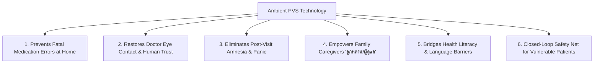

# Problem Statement & Patient-Centric Need: AI Doctor Advice & Caregiver Summarization

---

## 1. Executive Summary

Healthcare outcomes depend heavily on what happens *after* a patient leaves the medical clinic or hospital. However, a severe communication breakdown exists between clinicians, patients, and family caregivers. 

Complex medical jargon, extreme doctor time constraints, low health literacy, and lack of actionable instructions for family members lead to widespread medication errors, preventable emergency room visits, and costly hospital readmissions.

This project addresses this systemic failure by developing an **Ambient AI Doctor Advice & Caregiver Summarization Platform** that converts complex doctor-patient-family dialogue into clear, plain-language, role-tailored action plans for both patients and their family relatives.

---

## 2. Deep Research on the 6 Barriers to Ambient PVS Adoption

Understanding why Ambient PVS is not yet ubiquitous requires analyzing 6 core clinical, financial, technical, and operational friction points:

```
┌─────────────────────────────────────────────────────────────────────────────┐
│                    THE 6 ADOPTION BARRIERS DEEP-DIVE                        │
├──────────────────────────┬──────────────────────────────────────────────────┤
│ 1. Malpractice Liability │ 🔴 "Captain of the Ship" legal fear forces doctor │
│    & Review Bottleneck   │    to audit line-by-line, slowing OPD workflow.  │
├──────────────────────────┼──────────────────────────────────────────────────┤
│ 2. Buyer Incentive       │ 🔴 Hospital CFOs buy AI for ICD-10 Billing/Coding│
│    Mismatch              │    rather than Patient Health Literacy.          │
├──────────────────────────┼──────────────────────────────────────────────────┤
│ 3. Chaotic Exam Room     │ 🔴 Ambient noise, overlapping multi-speakers, &   │
│    Acoustics & Speech    │    implicit/conditional clinical dialogue.      │
├──────────────────────────┼──────────────────────────────────────────────────┤
│ 4. Code-Switching &      │ 🔴 Global AI fails on Thai-English medical speech │
│    Language Barriers     │    ("อัพโดส Metformin 1000mg tid").              │
├──────────────────────────┼──────────────────────────────────────────────────┤
│ 5. Ambient Recording     │ 🔴 Patient & provider wiretapping/PDPA anxiety   │
│    Privacy & Consent     │    during sensitive medical consultations.       │
├──────────────────────────┼──────────────────────────────────────────────────┤
│ 6. Delivery Interop      │ 🔴 Advice gets trapped inside desktop EHRs       │
│    instead of reaching patient/caregiver LINE OA.│
└──────────────────────────┴──────────────────────────────────────────────────┘
```

### 1. Clinician Malpractice Liability & The Review Bottleneck
* **Legal Doctrine**: Under medical malpractice law (**"Captain of the Ship"**), the attending physician is legally liable for any incorrect dose, omitted drug warning, or hallucinated instruction handed to a patient.
* **Audit Friction**: Because clinicians fear AI hallucinations (e.g., omitting *"take with food"*), they feel compelled to read every line of an AI draft. If auditing takes 2 minutes in a 3-minute OPD consultation, **the AI slows down care**.
* **The Solution**: **Linked Audio Evidence**. Giving doctors 1-click audio timestamp verification (`[02:15-02:30]`) reduces sign-off audit time from 2 minutes to **<15 seconds**.

### 2. The Buyer Incentive Mismatch (Billing vs. Patient Care)
* **Institutional Buying Dynamics**: Hospital IT and CFOs traditionally purchase software that directly increases **billing coding accuracy (ICD-10/CPT), clinical documentation, and revenue cycle speed**.
* **Patient Neglect**: Consequently, early AI scribe vendors built tools for hospital billing rather than patient understanding.
* **The Shift**: Value-Based Care and readmission financial penalties (CMS HRRP) are now forcing health systems to care about patient comprehension.

### 3. Chaotic Exam Room Acoustics & Implicit Human Speech
* **Acoustic Noise**: Exam rooms feature background air conditioning noise, paper rustling, crying children, and doors opening/closing.
* **Implicit Speech**: Doctors rarely speak textbook sentences. They say: *"Let's hold off on the white pill if your stomach acts up."* Extracting precise, structured medication rules from implicit conversation requires domain-tuned clinical LLMs.

### 4. Code-Switching & Health Literacy Barriers
* **Thai-English Hybrid Speech**: Thai doctors routinely speak in **Thai-English Code-Switching** (*"หมอขออัพโดส Metformin เป็น 1000mg tid หลังอาหารนะครับ"*). Generic global AI fails to parse these Latin acronyms (*tid, bid, po, qd*) into 5th-grade Thai text.

### 5. Ambient Recording Privacy & Consent Anxiety
* **PDPA / HIPAA Compliance**: Recording live voice in exam rooms triggers privacy concerns and recording consent requirements.
* **Zero-Retention Solution**: Processing voice in ephemeral RAM enclaves with instant deletion after transcription ensures zero persistent audio storage.

### 6. Delivery Interoperability Bottleneck
* **Trapped Data**: Summaries generated by third-party AI scribes often remain trapped inside desktop hospital software. Without native **LINE Official Account (LINE OA)** or SMS integration, the advice never reaches the patient's mobile phone.

---

## 3. WHY THIS TECHNOLOGY IS CRITICALLY NEEDED BY THE PATIENT

While hospitals buy software for efficiency, **PATIENTS AND FAMILY CAREGIVERS DESPERATELY NEED THIS TECHNOLOGY TO SURVIVE AND RECOVER SAFELY AT HOME**.



### 1. Prevents Fatal Medication Errors at Home
* **The Patient Danger**: Patients routinely suffer adverse drug events at home because they cannot read doctor handwriting or confuse old prescriptions with new ones.
* **How Ambient PVS Helps**: Gives the patient and family a clear **Medication Reconciliation Matrix** (🟢 *Start*, 🔴 *Stop*, 🟡 *Change*), ensuring discontinued drugs are thrown away immediately.

### 2. Restores Doctor Eye Contact & Human Connection
* **The Patient Experience**: Patients report feeling ignored when doctors spend the entire visit staring at a computer screen typing EHR notes.
* **How Ambient PVS Helps**: Ambient passive listening lets the doctor look the patient in the eyes, listen empathetically, and build genuine human trust while the AI takes notes silently.

### 3. Eliminates "Post-Visit Amnesia" & Panic
* **The Patient Anxiety**: Over 60% of patients experience anxiety after leaving the hospital, terrified that they forgot an important instruction spoken by the doctor.
* **How Ambient PVS Helps**: Provides an instant, permanent **Digital Care Card on LINE OA / Mobile** that patients can re-read or replay via Text-to-Speech anytime.

### 4. Empowers Family Caregivers ("ลูกหลาน / ผู้ดูแล / อสม.")
* **The Caregiver Burden**: Adult children and spouses managing elderly relatives bear immense stress trying to guess what the doctor recommended.
* **How Ambient PVS Helps**: Generates a dedicated **Caregiver Task Matrix** featuring wound care steps, dietary prep rules, and observational red-flag emergency warnings.

### 5. Bridges Health Literacy & Language Barriers
* **The Literacy Gap**: Elderly and low-literacy patients cannot decipher medical jargon like *"hypertension"* or *"b.i.d."*.
* **How Ambient PVS Helps**: Rewrites complex clinical speech into **5th-grade plain language** (Thai/English) with voice audio playback for illiterate or visually impaired patients.

### 6. Closed-Loop Safety Net for Vulnerable Patients
* **The Isolation Risk**: After discharge, patients feel isolated with no easy way to confirm if their symptoms are normal.
* **How Ambient PVS Helps**: Includes **1-Tap Micro-Confirmations** (*"Confirm you stopped Aspirin"*) that give patients confidence and send confirmation receipts back to the care team.

---

## 4. Academic & Industry Product References

### 📚 Academic References & Clinical Studies
* **Kessels, R. P. (2003).** *Patients' memory for medical information.* Journal of the Royal Society of Medicine, 96(5), 219–222. [DOI: 10.1258/jrsm.96.5.219]
* **Stossel, L. M., et al. (2012).** *Readability of Patient Education Materials Provided at Hospital Discharge.* Journal of General Internal Medicine, 27(9), 1160–1167.
* **AMA & NIH Guidelines.** *Health Literacy and Patient Communication Manual.* American Medical Association & National Institutes of Health.
* **Sinsky, C., et al. (2016).** *Allocation of Physician Time in Ambulatory Care: An Observational Study in 4 Specialties.* Annals of Internal Medicine, 165(11), 753–760.
* **AARP & National Alliance for Caregiving (NAC). (2020).** *Caregiving in the U.S. 2020 Research Report.* AARP Family Caregiving.
* **Coleman, E. A., et al. (2006).** *The Care Transitions Intervention: Results of a Randomized Controlled Trial.* Archives of Internal Medicine, 166(17), 1822–1828.

### 🌐 Commercial Ambient PVS Product References
1. **Abridge Help Center**: *View a Patient Visit Summary (PVS)*  
   * URL: [https://support.abridge.com/hc/en-us/articles/30235136497811-View-a-Patient-Visit-Summary](https://support.abridge.com/hc/en-us/articles/30235136497811-View-a-Patient-Visit-Summary)
   * *Reference for Abridge's Patient Visit Summary UI, plain-language structuring, and linked audio evidence.*
2. **Heidi Health Blog**: *After Visit Summary Template with Examples*  
   * URL: [https://www.heidihealth.com/blog/after-visit-summary-template-with-examples](https://www.heidihealth.com/blog/after-visit-summary-template-with-examples)
   * *Reference for AI-enabled After Visit Summary (AVS) templates, patient summary structures, and letter formats.*
3. **Microsoft Cloud Healthcare Blog**: *DAX Copilot: New customization options and AI capabilities for even greater productivity (August 2024)*  
   * URL: [https://www.microsoft.com/en-us/microsoft-cloud/blog/healthcare/2024/08/08/dax-copilot-new-customization-options-and-ai-capabilities-for-even-greater-productivity/](https://www.microsoft.com/en-us/microsoft-cloud/blog/healthcare/2024/08/08/dax-copilot-new-customization-options-and-ai-capabilities-for-even-greater-productivity/)
   * *Reference for Microsoft DAX Copilot ambient documentation, Epic EHR integration, and patient care plan customization.*
