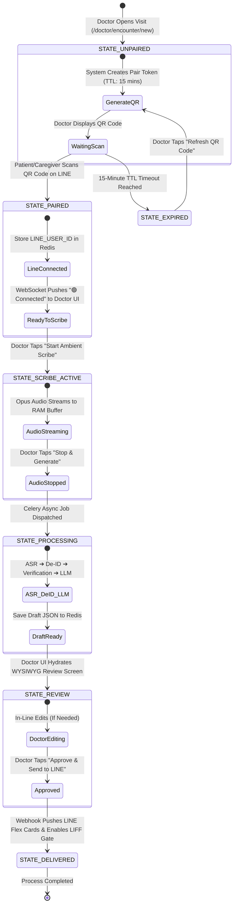
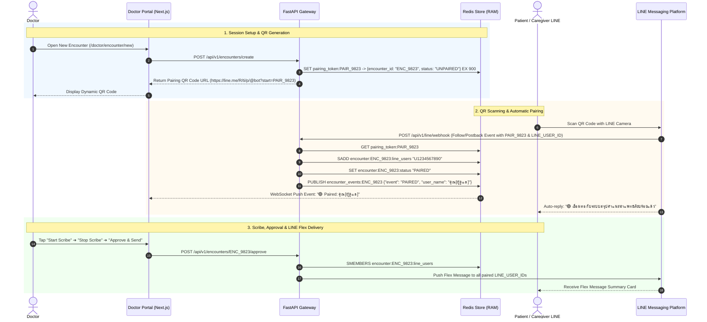

# Session Pairing State Machine & Expiration Logic Specification

---

## 🎯 1. Overview & Objectives

This specification defines the complete state machine, API sequence flow, and Redis data key lifecycle for in-clinic **Patient / Caregiver LINE Pairing**.

### 🌟 Design Goals
1. **Zero-PIN Pairing**: Scanning a dynamic QR code on LINE links `LINE_USER_ID` to `ENCOUNTER_ID` in **<2 seconds**.
2. **Multi-Recipient Support**: Allows both the Patient and Caregiver (up to 2 LINE accounts) to scan the same QR code and receive the summary simultaneously.
3. **Automated Expiration**: Enforces strict TTL (Time-To-Live) expirations on pairing tokens, audio buffers, and temporary draft keys in Redis.

---

## 🔄 2. State Machine Diagram



---

## 📡 3. Sequence Flow: In-Clinic Pairing to Delivery



---

## 🔑 4. Redis Data Key Lifecycle & Expiration (TTL) Matrix

To prevent memory bloat and guarantee data privacy, all Redis keys enforce strict **Time-To-Live (TTL)** expiration rules:

| Redis Key Pattern | Data Structure | Contents | TTL (Expiration) | Purpose |
| :--- | :--- | :--- | :---: | :--- |
| `pairing_token:{token}` | String (JSON) | `{"encounter_id": "ENC_9823", "status": "UNPAIRED"}` | **15 Minutes (900s)** | Short-lived QR code pairing window |
| `encounter:{id}:line_users` | Set | `["U1234567890", "U0987654321"]` | **24 Hours (86400s)** | Stores paired LINE user IDs for delivery |
| `encounter:{id}:status` | String | `"UNPAIRED"` ➔ `"PAIRED"` ➔ `"REVIEW"` ➔ `"DELIVERED"` | **24 Hours (86400s)** | Tracks encounter lifecycle state |
| `raw_audio_buffer:{id}` | List (Bytes) | Opus binary audio frames | **1 Hour (3600s)** | **Purged immediately** post-ASR transcription |
| `draft_summary:{id}` | String (JSON) | Unapproved draft JSON payload | **24 Hours (86400s)** | Temporary UI state cache |
| `liff_pdf_token:{token}` | String (JSON) | `{"encounter_id": "ENC_9823", "line_user_id": "U1234..."}` | **1 Hour (3600s)** | Authorizes ephemeral PDF stream view |

---

## 🚨 5. Edge Cases & Exception Recovery

```
┌─────────────────────────────────────────────────────────────────────────────┐
│                      PAIRING & LIFECYCLE EXCEPTION HANDLING                 │
├──────────────────────┬──────────────────────────────────────────────────────┤
│ Edge Case            │ Technical Recovery Mechanism                         │
├──────────────────────┼──────────────────────────────────────────────────────┤
│ 1. QR Code Expired   │ If patient scans after 15 minutes, LINE bot auto-     │
│    (TTL Exceeded)    │ replies: "⚠️ รหัสสแกนหมดอายุ โปรดแจ้งคุณหมอเพื่อขอรหัสใหม่" │
│                      │ UI shows 1-click "🔄 Refresh QR Code" button.        │
├──────────────────────┼──────────────────────────────────────────────────────┤
│ 2. Multiple Scans    │ Up to 2 relatives scan the same QR code. Both        │
│    (Patient + Relative)│ `LINE_USER_ID`s are added to `encounter:{id}:line_users`│
│                      │ set so both receive summaries simultaneously.        │
├──────────────────────┼──────────────────────────────────────────────────────┤
│ 3. Unpair / Cancel   │ Doctor can tap "❌ Cancel Visit" on UI, which deletes │
│    Visit Session     │ `pairing_token` and `encounter` keys in Redis instantly.│
└──────────────────────┴──────────────────────────────────────────────────────┘
```
