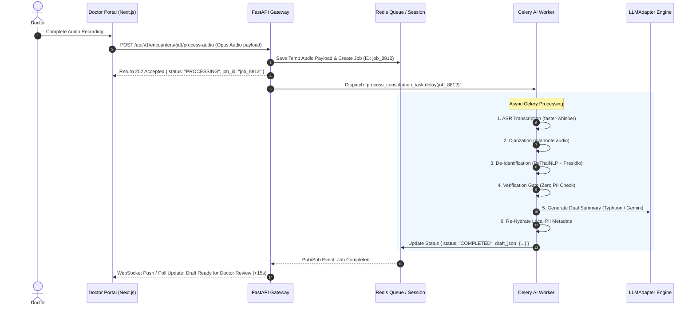
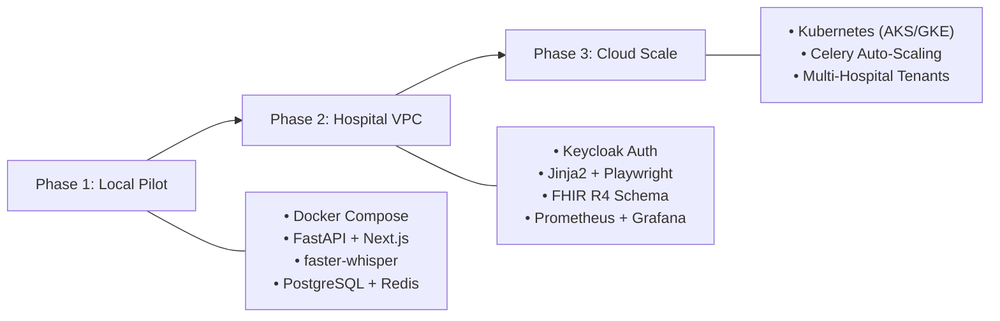

# Master System Architecture: Ambient AI Doctor Advice & Caregiver Summarization (PVS Platform)

---

## 1. Executive Summary & Production Philosophy

The **Ambient AI Doctor Advice & Caregiver Summarization Platform (Ambient PVS)** is an AI-first healthcare platform that transforms real-time doctor-patient dialogues into plain-language, role-tailored summaries.

### 🌟 Core Architectural Principles
1. **Async AI Task Queue (Non-Blocking Pipeline)**: Offloads heavy ASR, Diarization, De-Identification, and LLM summarization to **Celery + Redis workers** so HTTP/WebSocket endpoints never block.
2. **Dual ASR Strategy**: Supports **Self-Hosted `faster-whisper` (GPU/CUDA)** or `whisper.cpp` (CPU) for zero legal DPA friction, with configurable fallbacks to Azure/Google/Gowajee STT APIs.
3. **Multi-Engine De-Identification & Verification Gate**: Combines **PyThaiNLP**, **Microsoft Presidio**, and Regex patterns with an automated **Verification Gate** to guarantee 100% PII removal before sending data to LLMs.
4. **Unified `LLMAdapter` Layer**: Clean abstraction layer supporting **Typhoon 1.5 Medical (Thai Native)**, **Google Gemini 1.5 Flash**, **Azure OpenAI GPT-4o-mini**, or **Local Llama-3/Typhoon-7B**.
5. **Python-Native PDF Engine (Jinja2 + Playwright)**: Compiles responsive HTML templates into pixel-perfect, watermarked PDFs using **Playwright** with Google Font **Sarabun**, streamed safely over LINE LIFF without public cloud file leaks.
6. **Hospital-Grade Auth & FHIR R4 Readiness**: Uses **Keycloak** (self-hosted OIDC/LDAP/Active Directory) and structures internal backend schemas around **HL7 FHIR R4** standards (`Patient`, `Encounter`, `Practitioner`, `MedicationRequest`, `DocumentReference`) to guarantee seamless future HOSxP/EHR integrations.

---

## 2. Master Production System Architecture

```mermaid
graph TD
    subgraph 1. Frontend Layer (Doctor & Patient)
        A1["💻 Doctor Dashboard (Next.js 15 + shadcn/ui)"] -->|WebSocket / HTTPS| B1["⚡ FastAPI API Gateway"]
        A2["📲 Patient / Caregiver LINE App"] -->|LINE LIFF SDK| B1
    end

    subgraph 2. Backend Gateway & Task Queue
        B1 -->|Pairing & State| C1["🔴 Redis Session Store & Cache"]
        B1 -->|Persist Records| C2["🐘 PostgreSQL DB (SQLAlchemy / Alembic)"]
        B1 -->|Async AI Job Push| D1["⚙️ Celery Task Queue (Redis / RabbitMQ Broker)"]
    end

    subgraph 3. AI Processing Pipeline (Celery Workers)
        D1 -->|1. Transcribe| E1["🗣️ ASR Engine (faster-whisper / whisper.cpp / Gowajee)"]
        E1 -->|2. Diarize| E2["👥 Speaker Diarization (pyannote.audio / NeMo)"]
        E2 -->|3. De-Identify| E3["🛡️ De-ID Engine (PyThaiNLP + Presidio + Regex)"]
        E3 --> E4{"🔍 Internal Verification Gate"}
        E4 -->|✅ 100% Sanitized| E5["🧠 LLMAdapter (Typhoon / Gemini / GPT-4o / Llama)"]
        E5 -->|4. Re-Hydrate| E6["🔄 Metadata Re-Hydration Engine"]
        E6 -->|5. Update Status| B1
    end

    subgraph 4. Delivery & PDF Engine
        B1 -->|Trigger Webhook| F1["💬 LINE Messaging API (Python Bot SDK)"]
        F1 -->|Flex Messages| A2
        A2 -->|Tap PDF Download| G1["🔒 LIFF Authenticated Access Gate"]
        G1 -->|Render HTML via Jinja2| H1["📄 Playwright HTML-to-PDF Engine"]
        H1 -->|Stream Watermarked PDF| A2
    end

    subgraph 5. Observability & Security Enclave
        I1["🔐 Keycloak (OIDC / Active Directory / OAuth2)"] -.->|Auth Check| B1
        J1["📊 Prometheus + Grafana + structlog"] -.->|Monitor Latency/GPU/Queue| D1
    end
```

---

## 🛠️ 3. Recommended Production Technology Stack

```
┌─────────────────────────────────────────────────────────────────────────────┐
│                        MASTER PRODUCTION TECH STACK                         │
├──────────────────────┬──────────────────────────────────────────────────────┤
│ System Component     │ Recommended Choice & Rationale                       │
├──────────────────────┼──────────────────────────────────────────────────────┤
│ 1. Frontend          │ • Next.js 15 (App Router, TypeScript, React 19)      │
│    (Doctor Portal)   │ • Tailwind CSS + shadcn/ui + Lucide Icons            │
│                      │ • Recharts (Analytics) + Zustand (State)              │
│                      │ • React Hook Form + Zod (Validation)                 │
├──────────────────────┼──────────────────────────────────────────────────────┤
│ 2. Backend Gateway   │ • Python FastAPI (Async, Native Pydantic, WebSockets)│
│    & Workers         │ • Uvicorn / Gunicorn + Celery Async Task Queue        │
│                      │ • SQLAlchemy 2.0 (ORM) + Alembic (Database Migrations)│
├──────────────────────┼──────────────────────────────────────────────────────┤
│ 3. Database & Cache  │ • PostgreSQL 16 (Primary RDBMS, FHIR R4 JSONB)       │
│                      │ • Redis 7.0 (Session pairing, WebSockets, Celery Broker)│
├──────────────────────┼──────────────────────────────────────────────────────┤
│ 4. AI Pipeline       │ • ASR: faster-whisper (GPU/CUDA) / whisper.cpp (CPU) │
│                      │ • Diarization: pyannote.audio / NVIDIA NeMo          │
│                      │ • De-ID: PyThaiNLP + Microsoft Presidio + Regex      │
│                      │ • LLM: Typhoon 1.5 Medical / Gemini Flash / GPT-4o  │
├──────────────────────┼──────────────────────────────────────────────────────┤
│ 5. Delivery & PDF    │ • LINE Bot SDK (`line-bot-sdk-python`) + LIFF SDK    │
│                      │ • PDF: Jinja2 HTML Templates + Playwright Stream     │
├──────────────────────┼──────────────────────────────────────────────────────┤
│ 6. Auth & Security   │ • Keycloak (Self-hosted OIDC / LDAP / Active Directory)│
│                      │ • TLS 1.3 + AES-256 + Short-lived pre-signed tokens  │
├──────────────────────┼──────────────────────────────────────────────────────┤
│ 7. Observability &   │ • structlog + Prometheus + Grafana (GPU/Queue telemetry)│
│    Deployment        │ • Docker Compose (Pilot) ➔ Kubernetes (AKS/GKE Scale)│
└──────────────────────┴──────────────────────────────────────────────────────┘
```

---

## ⚡ 4. Async Task Execution Pipeline (Celery + Redis)

AI processing must **never block HTTP API requests**. Audio ingestion and summarization are offloaded to background Celery workers:



---

## 📄 5. PDF Generation Pipeline (Jinja2 + Playwright)

Replacing Puppeteer with **Playwright (Python)** provides robust multi-browser rendering and native integration with Python backend services:

```python
# app/services/pdf_service.py
from jinja2 import Environment, FileSystemLoader
from playwright.async_api import async_playwright
import io

async def generate_pvs_pdf(encounter_data: dict) -> bytes:
    """
    Renders a pixel-perfect Thai PDF Advice Sheet using Jinja2 HTML and Playwright.
    """
    # 1. Render Jinja2 HTML Template
    env = Environment(loader=FileSystemLoader("app/templates"))
    template = env.get_template("pvs_advice_sheet.html")
    rendered_html = template.render(data=encounter_data)

    # 2. Compile PDF via Ephemeral Playwright Chromium Stream
    async with async_playwright() as p:
        browser = await p.chromium.launch(headless=True)
        page = await browser.new_page()
        await page.set_content(rendered_html, wait_until="networkidle")
        
        pdf_bytes = await page.pdf(
            format="A4",
            print_background=True,
            margin={"top": "15mm", "bottom": "15mm", "left": "15mm", "right": "15mm"}
        )
        await browser.close()
        
    return pdf_bytes
```

---

## 🏥 6. Healthcare Integration & FHIR R4 Data Model

To ensure future interoperability with hospital electronic health record systems (HOSxP, Epic, Cerner), the backend data model is mapped directly to **HL7 FHIR R4** resources:

```
┌─────────────────────────────────────────────────────────────────────────────┐
│                      FHIR R4 DATA MODEL MAPPING                             │
├──────────────────────┬──────────────────────────────────────────────────────┤
│ FHIR R4 Resource     │ Application Data Mapping                             │
├──────────────────────┼──────────────────────────────────────────────────────┤
│ 1. `Patient`         │ Demographics, LINE User ID pairing, Emergency Contact│
├──────────────────────┼──────────────────────────────────────────────────────┤
│ 2. `Practitioner`    │ Attending Doctor Profile, License ID, Department     │
├──────────────────────┼──────────────────────────────────────────────────────┤
│ 3. `Encounter`       │ OPD Visit Session, Date, Department, Audio Metadata  │
├──────────────────────┼──────────────────────────────────────────────────────┤
│ 4. `MedicationRequest`│ Start 🟢, Stop 🔴, and Change 🟡 Prescriptions Matrix│
├──────────────────────┼──────────────────────────────────────────────────────┤
│ 5. `DocumentReference`│ Generated PDF Patient Advice Card & LINE Flex Link  │
└──────────────────────┴──────────────────────────────────────────────────────┘
```

---

## 🔒 7. Hospital Security & Identity Governance

* **Authentication**: **Keycloak** (Self-hosted container) integrated via OpenID Connect (OIDC) / OAuth2. Supports hospital Active Directory (AD) and LDAP single sign-on (SSO).
* **Encryption Standards**:
  * Data in Transit: **TLS 1.3** across all WebSocket and HTTPS routes.
  * Data at Rest: **AES-256** column-level encryption for database PHI fields.
* **Audit Logging**: Every access attempt to PHI is captured by `structlog` and indexed in **Grafana Loki** for PDPA Section 39 compliance.

---

## 📌 8. [FLAGGED FOR FUTURE USER REVIEW] Patient & Caregiver Actual Needs Analysis

> [!NOTE]
> **📌 MARKED FOR FUTURE DEEP REVIEW**: This section analyzes the evidence-based actual needs of patients and family caregivers to guide future UI/UX iteration.

### 👴 A. What Patients ACTUALLY Need (The Elderly / Vulnerable Patient)
1. **Grade 5 Plain Language (No Medical Jargon)**:
   * *Bad*: *"Hypertension, take Metformin 1000mg b.i.d."*
   * *Good*: *"ยาลดความดัน และยาปรับน้ำตาล ให้ทานวันละ 2 ครั้ง หลังอาหารเช้า-เย็น"*
2. **Visual Schedule Icons (Time-of-Day Cues)**:
   * 🌅 **เช้า (Morning)** | ☀️ **กลางวัน (Noon)** | 🌇 **เย็น (Evening)** | 🌙 **ก่อนนอน (Bedtime)**
3. **High-Contrast, Large Typography**:
   * Minimum **18pt - 20pt Thai Font** for mobile screens and PDFs.
4. **Text-to-Speech (Audio Button)**:
   * Elderly patients with cataracts or low literacy need a **1-tap audio playback button** to listen to the doctor's instructions.
5. **Actionable Emergency Triggers ("What IF...")**:
   * Bolded red box showing exactly when to stop waiting and call for emergency help (with 1-tap call to **1669**).

---

### 👩‍👧 B. What Caregivers ACTUALLY Need (The Adult Child / Relative)
1. **Medication Reconciliation Matrix with Physical Identifiers**:
   * Caregivers don't just need chemical names; they need **physical pill descriptions**:
     * 🟢 **START**: *Metformin 1000mg (เม็ดใหญ่สีขาว)* — 1 เม็ดหลังอาหารเช้า-เย็น
     * 🔴 **STOP**: *ยาเม็ดเล็กสีขาวซองเดิม* — **ให้หยิบทิ้งถังขยะทันที**
2. **Explicit Discontinuation / Trash Instructions**:
   * The #1 cause of home medication errors is patients taking old discontinued pills alongside new ones.
3. **Daily Home Care & Checklist**:
   * Wound care schedule, blood pressure tracking logs, and dietary restriction rules.
4. **Closed-Loop Micro-Confirmation Button**:
   * 1-tap button in LINE OA: *"ยืนยัน: เก็บยาตัวเดิมออกจากตลับยาแล้ว"* sending a read receipt back to the clinic.

---

## 🚀 9. Multi-Stage Deployment Strategy


