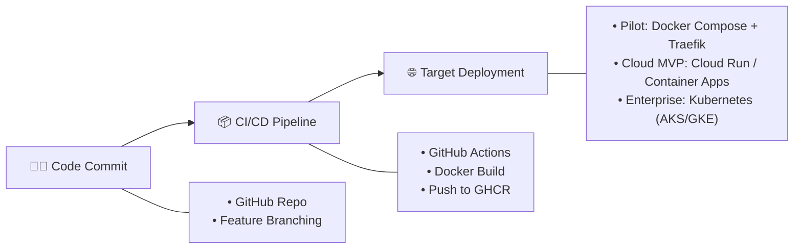

# Technology Stack Specification: Ambient AI Doctor Advice & Caregiver Summarization Platform (PVS)

---

## 1. Executive Summary

This document specifies the complete, production-grade **Technology Stack** for the Ambient PVS Platform. Designed specifically as an **AI-First Healthcare Platform**, the stack optimizes for:
* ⚡ **High-Performance Audio Ingestion**: WebSockets + Ephemeral RAM processing.
* 🛡️ **PDPA & Health Data Privacy**: Local De-Identification + Zero Audio Disk Storage.
* 🧠 **Flexible AI Orchestration**: Async Celery Task Queue + Unified `LLMAdapter` layer.
* 💬 **Zero-Barrier Delivery**: LINE Messaging API + LIFF Authenticated Gate + Streamed PDF.
* 🏥 **Hospital Integration Readiness**: Keycloak OIDC Auth + HL7 FHIR R4 Schema mapping.

---

## 💻 2. Frontend Layer (Doctor Portal & Scribe Web App)

| Component | Technology Choice | Version / Library | Purpose & Rationale |
| :--- | :--- | :--- | :--- |
| **Framework** | Next.js | 15.x (App Router) | Best-in-class React framework with Server Actions & SSR |
| **Language** | TypeScript | 5.x | Strict type safety across clinical data schemas |
| **Styling** | Tailwind CSS | 3.4+ / 4.x | Utility-first CSS for rapid, responsive UI development |
| **UI Components** | shadcn/ui | Latest | Clean, accessible, medical-grade UI component library |
| **Icons** | Lucide React | Latest | High-clarity visual icons for clinical badging |
| **Data Viz** | Recharts | Latest | Render analytics charts on doctor/admin dashboards |
| **State Management**| Zustand | 4.x | Lightweight, unopinionated state store for audio & drafts |
| **Form Handling** | React Hook Form | Latest | High-performance form state management |
| **Validation** | Zod | 3.x | Type-safe schema validation matching backend Pydantic |
| **Audio Capture** | MediaRecorder API | Native Browser API | Web Opus/PCM 16kHz audio chunk streaming |

---

## ⚡ 3. Backend Gateway & Middleware Layer

| Component | Technology Choice | Version / Library | Purpose & Rationale |
| :--- | :--- | :--- | :--- |
| **Framework** | Python FastAPI | 0.110+ | Async, high-concurrency API framework with native OpenAPI |
| **ASGI Server** | Uvicorn / Gunicorn | Latest | Production-grade async HTTP & WebSocket server |
| **ORM** | SQLAlchemy | 2.0+ (AsyncIO) | Modern Python ORM for PostgreSQL interaction |
| **Migrations** | Alembic | Latest | Database schema versioning and migration control |
| **Data Validation** | Pydantic | v2.x | Data validation and FHIR R4 resource schema enforcement |
| **WebSockets** | FastAPI WebSockets | Native | Real-time audio ingestion and live job status updates |

---

## ⚙️ 4. Async Task Queue & Background Workers

| Component | Technology Choice | Version / Library | Purpose & Rationale |
| :--- | :--- | :--- | :--- |
| **Task Queue** | Celery | 5.x (Python) | Distributed background task execution for heavy AI jobs |
| **Message Broker** | Redis / RabbitMQ | Redis 7.x | High-throughput in-memory job queue & result backend |

---

## 🧠 5. AI Ingestion & Processing Pipeline

| AI Subsystem | Selected Tool / Model | Host / Engine | Purpose & Function |
| :--- | :--- | :--- | :--- |
| **ASR Engine (Primary)** | `faster-whisper` | Local Docker (CUDA) | CTranslate2-accelerated Whisper-Large-v3-Turbo (4x faster) |
| **ASR Engine (CPU)** | `whisper.cpp` | C++ Binary / Docker | Lightweight CPU fallback for low-resource environments |
| **ASR Cloud Fallback**| Google STT / Azure Whisper | Private Cloud API | Configurable fallback under Enterprise ZDR agreements |
| **Speaker Diarization**| `pyannote.audio` / NeMo | Python / CUDA | 3-party voice separation (Doctor vs Patient vs Relative) |
| **Thai NLP & Tokenizer**| PyThaiNLP | 5.x | Thai word segmentation, honorifics, and entity detection |
| **De-Identification** | Microsoft Presidio + Regex | Python Local Enclave | PII/PHI redaction engine with internal Verification Gate |
| **LLM Adapter (Primary)**| Typhoon 1.5 Medical | Opn/SCB 10X API | Thai-native clinical LLM tuned for Grade 5 Thai summaries |
| **LLM Adapter (Cloud)** | Google Gemini 1.5 Flash | Vertex AI (Singapore) | Ultra-fast, long-context, low-cost cloud LLM option |
| **LLM Adapter (Enterprise)**| Azure OpenAI (GPT-4o-mini)| Azure Enterprise | Gold-standard HIPAA/ISO enterprise LLM option |
| **LLM Adapter (On-Prem)**| Llama-3 / Typhoon-7B | Ollama / vLLM | 100% private, self-hosted on-premise LLM option |

---

## 📄 6. PDF Generation & LINE Delivery Engine

| Component | Technology Choice | Library / SDK | Purpose & Rationale |
| :--- | :--- | :--- | :--- |
| **Messaging API** | LINE Bot SDK Python | `line-bot-sdk-python` | Official SDK for Flex Message push & Webhook handling |
| **LINE LIFF** | LINE LIFF SDK | `@line/liff` 2.x | Front-end authentication gate inside LINE in-app browser |
| **HTML Templating** | Jinja2 | 3.x (Python) | Responsive HTML advice sheet template engine |
| **PDF Renderer** | Playwright (Python) | `playwright` 1.x | Headless Chromium rendering pixel-perfect PDF streams |
| **Thai Font** | Google Font **Sarabun** | Open Font License | Guarantees zero vowel/tone mark glyph breaking |

---

## 🐘 7. Database, Caching & Data Models

| Storage Layer | Technology Choice | Configuration | Purpose & Function |
| :--- | :--- | :--- | :--- |
| **Primary RDBMS** | PostgreSQL 16 | JSONB enabled | Stores encounters, user accounts, and FHIR R4 resources |
| **In-Memory Store** | Redis 7.0 | Ephemeral Cache | Session pairing, WebSocket state, rate-limiting, & Celery broker |
| **Data Schema** | HL7 FHIR R4 Mapped | `Patient`, `Encounter`, `MedicationRequest`, `DocumentReference` |

---

## 🔐 8. Authentication, Security & Compliance

| Security Layer | Technology Choice | Specification | Purpose & Function |
| :--- | :--- | :--- | :--- |
| **Identity Management**| Keycloak (Self-Hosted) | OIDC / OAuth2 / LDAP | Enterprise SSO integrated with Hospital Active Directory |
| **Cloud Auth (Option)**| Auth0 | OAuth2 / OIDC | Managed cloud identity alternative for MVP |
| **Transit Security** | TLS 1.3 / WSS | 256-bit SSL | Enforced encryption across all HTTP, WSS, and API routes |
| **Rest Security** | AES-256 Encryption | Field-Level DB Encryption | Encrypts PHI fields at rest in PostgreSQL |
| **Audio Privacy** | Ephemeral RAM Buffer | `tmpfs` / Zero Disk Write | Audio processed in memory and purged immediately |

---

## 📊 9. Observability, Monitoring & Logging

| Tool | Category | Target Metrics / Telemetry |
| :--- | :--- | :--- |
| **`structlog`** | Structured Logging | JSON-formatted application logs tagged with correlation IDs |
| **Prometheus** | Metrics Collection | GPU VRAM usage, Celery queue depth, ASR latency, HTTP errors |
| **Grafana** | Visual Dashboards | Real-time operational health & performance dashboards |
| **Loki** | Log Aggregation | Searchable log repository for PDPA Section 39 audit trails |

---

## 🚀 10. DevOps, CI/CD & Deployment Architecture

| Deployment Tier | Stack Configuration | Infrastructure Target |
| :--- | :--- | :--- |
| **Development / Pilot** | Docker Compose + Traefik Reverse Proxy | Single Ubuntu 24.04 LTS GPU Server |
| **Cloud MVP Tier** | Google Cloud Run / Azure Container Apps | Serverless Containers (Auto-scaling) |
| **Enterprise Hospital Tier**| Kubernetes (AKS / GKE) + Keycloak | Multi-node cluster with dedicated GPU pools |
