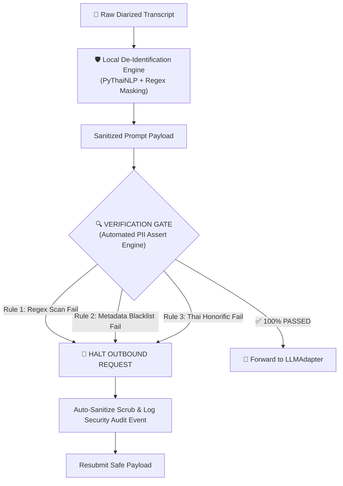

# Verification Gate & Exception Handling Rules Specification

---

## 🎯 1. Overview & Compliance Objectives

This specification defines the internal **Sanitization Verification Gate** and the **System Exception Handling Matrix** for the Ambient PVS Platform.

### 🛡️ Core Security Goal
Ensure **100% Zero PII/PHI leakage** to external cloud LLM APIs (Gemini, Typhoon, Azure OpenAI) or local LLM context windows, strictly enforcing **Thailand PDPA Section 26 & Section 37** compliance.

---

## 🔍 2. Internal Verification Gate Inspection Architecture

The Verification Gate acts as a **hard security firewall** between the Local De-Identification Engine (`mask_transcript()`) and the Clinical LLM Adapter:



---

## 📋 3. Automated Inspection Rules & Assert Rules

Before releasing any text prompt to the LLM API, the Verification Gate executes 3 mandatory inspection passes:

### Rule 1: Regex Pattern Scan
Scans prompt text for residual unmasked identifiers:
```python
REGEX_PATTERNS = {
    "CITIZEN_ID": r'\b\d{13}\b|\b\d{1}-\d{4}-\d{5}-\d{2}-\d{1}\b',
    "PHONE_NUMBER": r'\b0\d{8,9}\b|\b0\d{1,2}[- ]?\d{3,4}[- ]?\d{4}\b',
    "HOSPITAL_NUMBER": r'(?i)\b(HN|hn|เอชเอ็น)\s*:?\s*[\d-]+\b'
}
```
* **Assert**: If `re.search(pattern, prompt_text)` returns `TRUE`, inspection fails.

### Rule 2: Session Metadata Blacklist Scan
Checks prompt text against the exact raw strings stored in session metadata:
```python
SESSION_METADATA_BLACKLIST = [
    patient_raw_name,
    caregiver_raw_name,
    doctor_raw_name,
    patient_raw_hn,
    caregiver_raw_phone
]
```
* **Assert**: If any raw string in `SESSION_METADATA_BLACKLIST` exists inside `prompt_text`, inspection fails.

### Rule 3: Thai Honorific Unmasked Name Scan
Scans for unmasked Thai names following common honorific prefixes:
```python
HONORIFIC_PATTERN = r'(คุณ|นาย|นาง|นางสาว|เด็กชาย|เด็กหญิง)\s*([ก-๙]+)'
```
* **Assert**: If an unmasked name follows a Thai honorific (and does not equal `[PATIENT_NAME]` or `[CAREGIVER_NAME]`), inspection fails.

---

## 🚨 4. Verification Gate Failure Execution Protocol

If any verification rule fails:
1. **Outbound Request Halted**: The HTTP payload to the LLM API is **immediately blocked**.
2. **Audit Logging**: An immutable event is logged to `security_audit_logs` table:
   ```json
   {
     "event": "VERIFICATION_GATE_BLOCK",
     "encounter_id": "ENC_9823",
     "failed_rule": "RULE_2_METADATA_BLACKLIST",
     "detected_pii_type": "PATIENT_NAME",
     "action_taken": "AUTO_REDACTED_AND_RESUBMITTED"
   }
   ```
3. **Auto-Scrub & Resubmit**: The detected text block is forcefully replaced with `[UNMASKED_PII_REDACTED]` and resubmitted to the LLM.

---

## 💥 5. System Exception & Failure Recovery Matrix

Below is the complete operational recovery matrix for all system failure modes:

| Failure Mode | Root Cause | System Behavior & UX Recovery |
| :--- | :--- | :--- |
| **1. WebSocket Audio Disconnect** | Mobile screen lock / Network drop during OPD recording | • Audio frames buffered in browser `IndexedDB`.<br>• Client attempts auto-reconnect every 2s for 30s.<br>• Upon reconnect, missing audio chunks upload seamlessly. |
| **2. Empty / Silent Transcript** | Background noise or silent exam room | • ASR returns `<5 words`.<br>• Doctor Portal shows warning: *"⚠️ ไม่พบบทสนทนาที่ชัดเจน โปรดกดบันทึกใหม่ หรือพิมพ์ข้อความเพิ่มเติม"* |
| **3. LLM Schema Parsing Error** | LLM output malformed JSON or omits fields | • Pydantic validator catches `ValidationError`.<br>• Celery task retries LLM call once with explicit JSON correction prompt.<br>• If second call fails, populates default safe template with edit tag. |
| **4. LINE Messaging API Timeout** | LINE Webhook endpoint network latency | • Celery retries push notification with exponential backoff (3 retries: 5s, 15s, 45s).<br>• Summary remains available on Doctor Dashboard. |
| **5. PDF Generation Crash (Playwright)** | Headless Chromium process crash or memory timeout | • Playwright task times out after 10s.<br>• System falls back to lightweight HTML LIFF viewer inside LINEchat so patient can view summary instantly. |
| **6. Redis Session Eviction** | High RAM usage triggering cache eviction | • Vital encounter metadata backed up synchronously in PostgreSQL `encounters` table.<br>• Hydrates state from DB automatically if Redis key is missing. |
